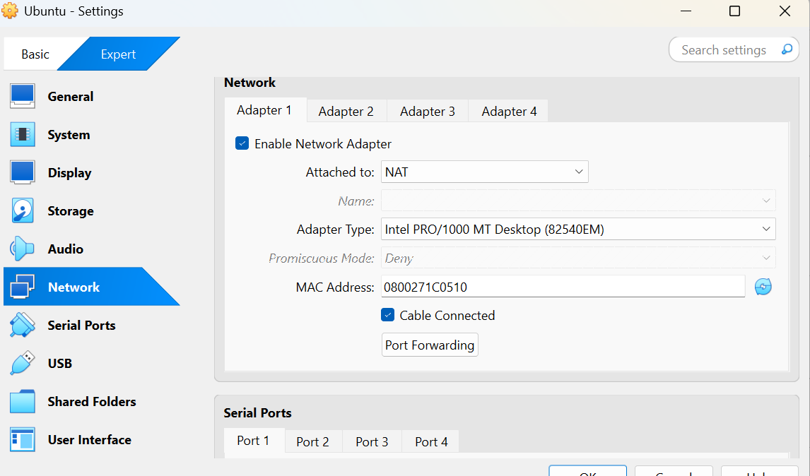
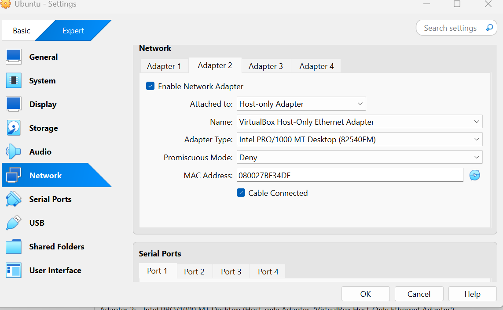

# 📅 Week 1 – System Setup and Architecture Planning

---

## ✅ Overview

In Week 1, I created a headless Linux server environment using **Ubuntu Server 22.04 LTS** within **VirtualBox**. I configured the system for remote SSH access, set up networking using both NAT and Host-Only adapters, and documented the architecture with a visual diagram. This setup forms the secure foundation for the remaining weeks of the Operating Systems coursework.

---

## 🐧 Linux Distribution Selection

I selected **Ubuntu Server 22.04 LTS** due to the following reasons:

- Long-Term Support (LTS) until 2027
- Minimal, secure server edition (no GUI)
- Strong community support and documentation
- Widely used in cloud and enterprise environments
- Comes with AppArmor, UFW, and support for unattended upgrades

### ❗ Alternatives Considered

| Distribution | Pros                        | Cons                             |
|--------------|-----------------------------|----------------------------------|
| Debian       | Very stable, lightweight    | Slower updates, less user-friendly |
| CentOS       | Enterprise-grade            | CentOS Stream introduces instability |
| Alpine Linux | Very minimal footprint      | Too lightweight for this course |

---

## 🧰 Virtual Machine Configuration

| Setting        | Value                       |
|----------------|-----------------------------|
| Virtualisation | VirtualBox                  |
| OS             | Ubuntu Server 22.04 LTS     |
| RAM            | 2048 MB                     |
| CPU Cores      | 2                           |
| Disk Size      | 15 GB (dynamically allocated) |
| Boot Mode      | Headless (CLI only)         |
| Display        | None                        |

---

## 🌐 Network Configuration

To securely access the server and allow internet access, I configured two adapters:

- **Adapter 1 – NAT:** Provides internet access for system updates and package installation.
- **Adapter 2 – Host-Only:** Enables private SSH access from the host machine to the VM.

### 🔌 VirtualBox Adapter Screenshots

#### Adapter 1 – NAT



#### Adapter 2 – Host-Only



---

## 📊 System Architecture Diagram

Below is the system architecture diagram showing the host, VM, and network setup:


---

## 🔐 OpenSSH Server Setup

### ✅ Installation and Service Configuration

```bash
sudo apt update
sudo apt install openssh-server
sudo systemctl enable ssh
sudo systemctl start ssh
sudo systemctl status ssh
✅ Testing SSH Access
bash
Copy code
ssh student@192.168.56.102
📸 SSH Access Screenshot

📂 System Information and Command Outputs
🔹 ip a – IP Address and Interfaces

bash
Copy code
3: enp0s8: <BROADCAST,MULTICAST,UP,LOWER_UP> mtu 1500 ...
    inet 192.168.56.102/24 brd 192.168.56.255 scope global dynamic enp0s8
🔹 df -h – Disk Space Usage
bash
Copy code
Filesystem      Size  Used Avail Use% Mounted on
/dev/sda2        15G  1.2G   13G   9% /
🔹 free -h – Memory Usage
bash
Copy code
              total        used        free
Mem:          1.9Gi       200Mi       1.6Gi
Swap:         975Mi          0B       975Mi
🔹 uname -a – Kernel Version
bash
Copy code
Linux ubuntu 5.15.0-91-generic #101-Ubuntu SMP ...
🔹 lsb_release -a – OS Release Info
bash
Copy code
Distributor ID: Ubuntu
Description:    Ubuntu 22.04.3 LTS
Release:        22.04
Codename:       jammy
🔹 whoami / hostname
bash
Copy code
student
ubuntu-server
