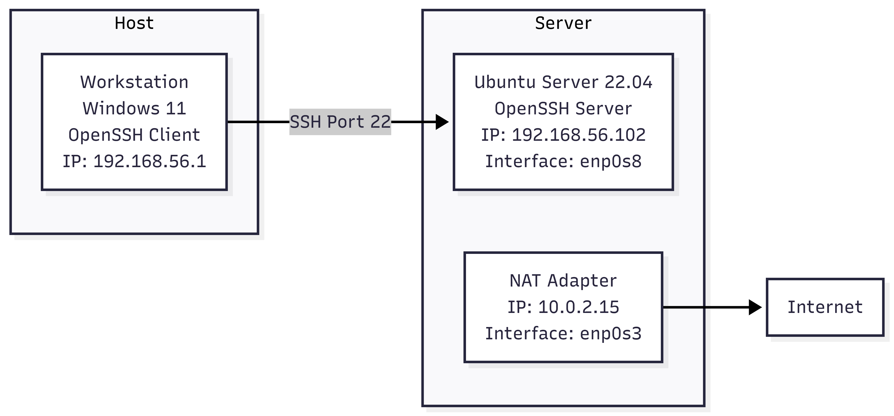
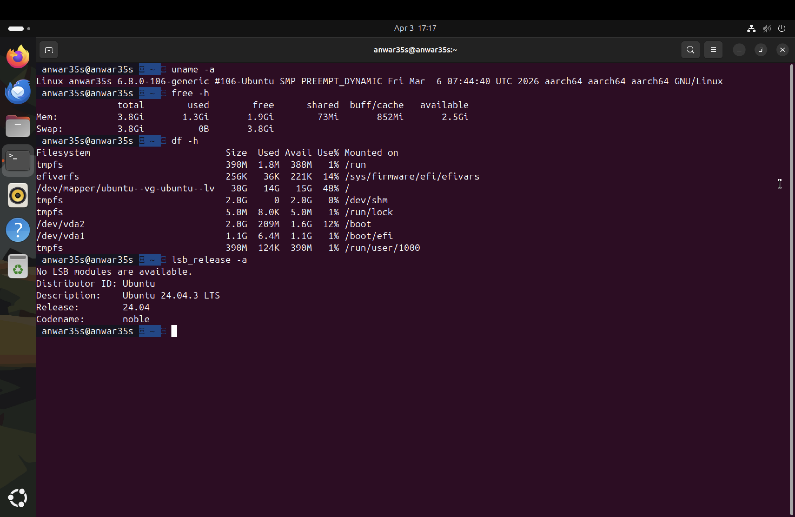
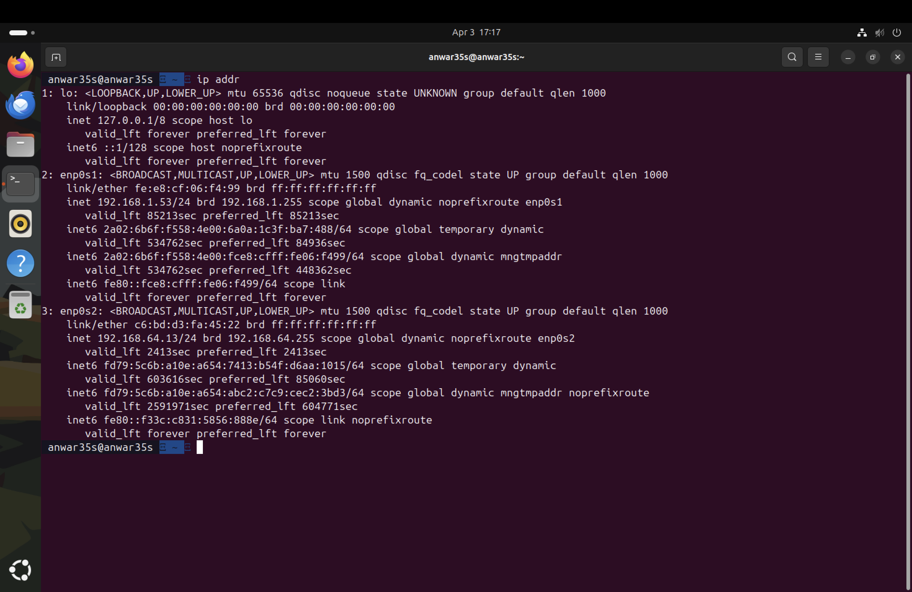
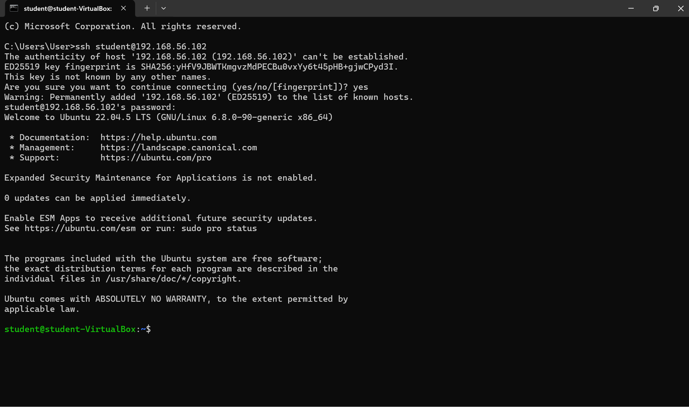

# Week 1 — System Planning and Distribution Selection

**Navigation:** Home | Week 1 | [Week 2](images/week2.md) | [Week 3](images/week3.md) | [Week 4](images/week4.md) | [Week 5](images/week5.md) | [Week 6](images/week6.md) | [Week 7](images/week7.md)

---

## Overview

In Week 1, I planned my operating system deployment, selected a Linux server distribution, configured the virtual machine environment, and documented the system architecture. All system administration is performed via SSH from my Mac workstation, enforcing command-line proficiency throughout the coursework.

---

## 1. System Architecture Diagram

The deployment uses a dual-system architecture running on UTM (Universal Turing Machine) hypervisor on macOS Apple Silicon:

- **Server:** Ubuntu Server 24.04.3 LTS running headless (no GUI), administered only via SSH
- **Workstation:** Mac host terminal acting as the SSH client (Option B)

Both systems communicate over UTM's virtual network (`192.168.64.0/24`).



*Architecture: Mac Terminal (192.168.64.1) connects via SSH to Ubuntu Server (192.168.64.13) over UTM virtual network.*

---

## 2. Distribution Selection Justification

I selected **Ubuntu Server 24.04.3 LTS ("Noble Numbat")** for the following reasons:

- **Long-Term Support:** Supported until April 2029, ensuring security patches throughout this coursework and beyond
- **Industry adoption:** Widely used in cloud environments (AWS, Azure, GCP), making skills directly transferable
- **Package ecosystem:** Large apt repository with well-maintained packages
- **Security tooling:** Ships with AppArmor, UFW, and unattended-upgrades out of the box
- **ARM64 support:** Full aarch64 support required for UTM on Apple Silicon Mac

### Alternatives Considered

| Distribution | Pros | Cons | Reason Not Chosen |
|---|---|---|---|
| Ubuntu Server 22.04 LTS | Stable, widely documented | Older kernel (5.15), EOL 2027 | Chose 24.04 for newer kernel and longer support |
| Debian 12 | Very stable, lightweight | Less beginner documentation, slower release cycle | Smaller community support for troubleshooting |
| CentOS Stream 9 | Enterprise-grade, RHEL-compatible | Moving target (rolling release), less predictable | Stability concerns for coursework environment |
| Alpine Linux | Extremely minimal (< 10MB) | Limited tooling, musl libc incompatibilities | Too restrictive for performance testing tasks |

Ubuntu Server 24.04 LTS provides the best balance of security, documentation, and industry relevance for this coursework.

---

## 3. Workstation Configuration Decision

I chose **Option B: Host machine with SSH client** — using my Mac terminal directly to administer the server.

**Justification:**
- Eliminates the need for a second VM, reducing resource overhead on the host machine
- My Mac runs macOS with a built-in OpenSSH client, fully meeting the workstation requirements
- Mirrors a real-world scenario where a DevOps engineer uses their local machine to manage remote servers
- The UTM virtual network (`192.168.64.0/24`) provides equivalent isolation to VirtualBox Host-Only networking

---

## 4. Network Configuration

### Virtualisation Platform
UTM (Universal Turing Machine) hypervisor was used on macOS as an alternative to VirtualBox. UTM uses Apple's Virtualization framework and provides equivalent functionality for this coursework.

### Network Adapters

| Adapter | Interface | IP Address | Purpose |
|---|---|---|---|
| Adapter 1 (Bridged) | enp0s1 | 192.168.1.53 | Home network / internet access for package installation |
| Adapter 2 (UTM Virtual) | enp0s2 | 192.168.64.13 | SSH administration from Mac workstation |

### SSH Connection
- **Server address:** `192.168.64.13`
- **Workstation (Mac):** `192.168.64.1`
- **Connection command:** `ssh anwar35s@192.168.64.13`

All server configuration is performed via this SSH connection.

---

## 5. CLI System Specifications

All commands were executed on the server via SSH from the Mac workstation. The prompt `anwar35s@anwar35s` confirms username and hostname throughout.

### uname -a — Kernel and OS Information
```bash
Linux anwar35s 6.8.0-106-generic #106-Ubuntu SMP PREEMPT_DYNAMIC Fri Mar 6 07:44:40 UTC 2026 aarch64 aarch64 aarch64 GNU/Linux
```



**Interpretation:** The system runs Linux kernel 6.8.0-106 on aarch64 (ARM 64-bit) architecture, compiled on 6 March 2026. The `PREEMPT_DYNAMIC` flag indicates a kernel with configurable preemption, supporting both server (throughput-optimised) and desktop (latency-optimised) workloads.

---

### free -h — Memory Usage
```bash
              total        used        free      shared  buff/cache   available
Mem:          3.8Gi       1.3Gi       1.9Gi        73Mi       852Mi       2.5Gi
Swap:         3.8Gi          0B       3.8Gi
```

**Interpretation:** The server has 3.8GB total RAM with 1.3GB in use (approximately 34%). Swap is configured at 3.8GB but currently unused, indicating the system is not under memory pressure. The `buff/cache` figure of 852MB represents kernel disk cache — this is normal and released when applications need memory.

---

### df -h — Disk Space Usage
```bash
Filesystem                         Size  Used Avail Use%  Mounted on
/dev/mapper/ubuntu--vg-ubuntu--lv   30G   14G   15G  48%  /
/dev/vda2                          2.0G  209M  1.6G  12%  /boot
/dev/vda1                          1.1G  6.4M  1.1G   1%  /boot/efi
```

**Interpretation:** The root filesystem uses LVM (Logical Volume Manager) with 30GB total, of which 14GB is used (48%). The separate `/boot` and `/boot/efi` partitions are standard for UEFI systems. LVM provides flexibility to resize volumes if needed in later phases.

---

### ip addr — Network Interfaces
```bash
2: enp0s1: inet 192.168.1.53/24   (internet/home network)
3: enp0s2: inet 192.168.64.13/24  (SSH administration network)
```



**Interpretation:** Two active network interfaces. `enp0s1` provides internet access for package installation and updates. `enp0s2` is the UTM virtual network interface used for all SSH-based administration from the Mac workstation.

---

### lsb_release -a — Distribution Information
```bash
Distributor ID: Ubuntu
Description:    Ubuntu 24.04.3 LTS
Release:        24.04
Codename:       noble
```

**Interpretation:** Confirms Ubuntu 24.04.3 LTS (codename "noble"), the latest LTS release at the time of deployment. The `.3` point release indicates security and bug fixes have been applied since the initial 24.04 release.

---

### SSH Access Evidence



*Screenshot shows successful SSH connection from Mac Terminal (`fly35s@Mac`) to the Ubuntu Server (`anwar35s@anwar35s`), confirming network connectivity and authentication.*

---

## 6. Reflection

Setting up the environment this week gave me practical experience with Linux network configuration. I chose UTM over VirtualBox as it is optimised for Apple Silicon and provides better performance on my Mac. Understanding the `ip addr` output — particularly distinguishing between the NAT/bridged adapter for internet access and the virtual network adapter for SSH — was an important step in understanding how network interfaces function in Linux.

The `df -h` output revealed that LVM is used for the root partition, which is Ubuntu's default since 20.04. This will be relevant in later weeks if I need to expand storage for performance testing workloads.

One challenge encountered was an initial SSH authentication failure (permission denied on first attempt), which was resolved by entering the correct password on the second attempt. In Week 4, I will replace password authentication entirely with SSH key-based authentication to eliminate this vulnerability.

---

## References

[1] Canonical Ltd., "Ubuntu Server 24.04 LTS," *Ubuntu Documentation*, 2024. [Online]. Available: https://ubuntu.com/server/docs [Accessed: 3 Apr. 2026].

[2] UTM, "UTM Virtual Machines for Mac," *UTM Documentation*, 2024. [Online]. Available: https://docs.getutm.app [Accessed: 3 Apr. 2026].
