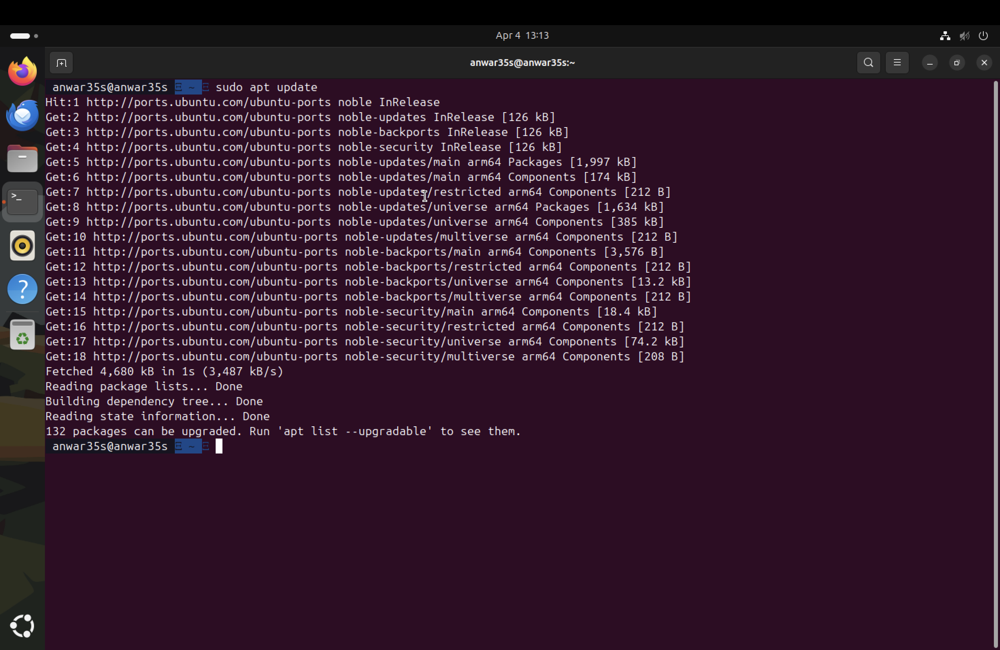
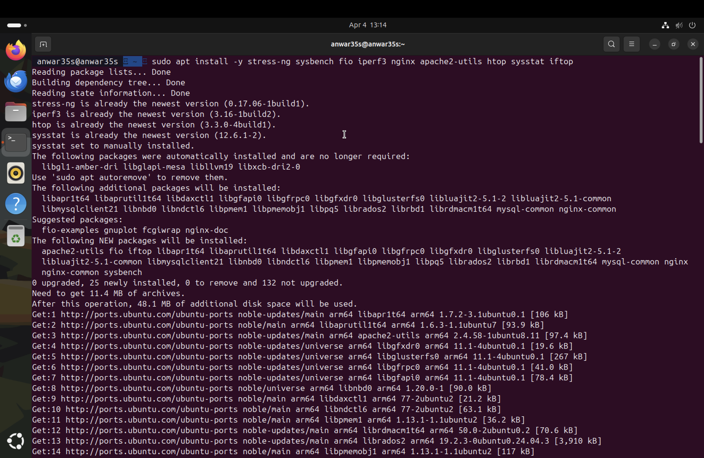
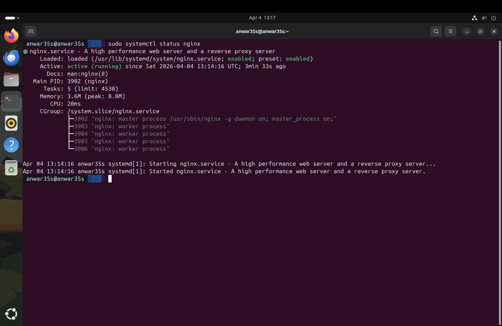
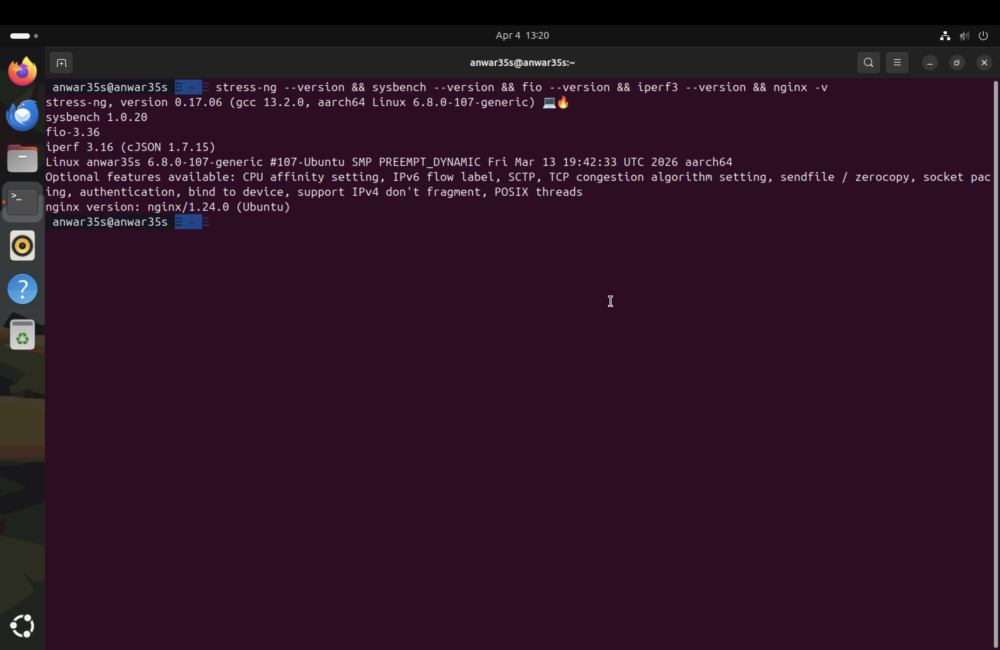

# Week 3 — Application Selection for Performance Testing

**Navigation:** [Week 1](week1.md) | [Week 2](week2.md) | Week 3 | [Week 4](week4.md) | [Week 5](week5.md) | [Week 6](week6.md) | [Week 7](week7.md)

---

## Overview

In Week 3, I selected applications representing five different workload types for performance evaluation in Week 6. Each application was chosen to stress a specific hardware resource, allowing me to observe how the Ubuntu Server operating system manages CPU scheduling, memory allocation, disk I/O, and network throughput under different conditions.

---

## 1. Application Selection Matrix

| Application | Workload Type | Primary Resource | Justification |
|---|---|---|---|
| `stress-ng` | CPU-intensive | CPU | Industry-standard stress testing tool, highly configurable, produces measurable and reproducible CPU loads |
| `sysbench` | RAM-intensive | Memory | Designed for database and memory benchmarking, allows precise control over memory allocation patterns |
| `fio` | I/O-intensive | Disk read/write | Purpose-built disk benchmarking tool used in enterprise environments, supports sequential and random I/O patterns |
| `iperf3` | Network-intensive | Network throughput | Standard network performance tool, measures TCP/UDP throughput and latency between server and workstation |
| `nginx` | Server application | CPU + Network | Lightweight, widely deployed web server — represents a realistic production workload; response time measurable with `curl` and `ab` |

---

## 2. Installation Documentation

All installation commands were executed on the server via SSH from the Mac workstation. The prompt `anwar35s@anwar35s` confirms all commands ran remotely.

### Step 1 — Update package lists
```bash
sudo apt update
```



*Package lists updated successfully. 132 packages available for upgrade, confirming the package manager is working and the server has internet access via enp0s1.*

---

### Step 2 — Install all applications
```bash
sudo apt install -y stress-ng sysbench fio iperf3 nginx apache2-utils htop sysstat iftop
```



*25 new packages installed including nginx, fio, sysbench, apache2-utils, and supporting libraries. stress-ng, iperf3, htop, and sysstat were already at their newest versions. Total additional disk space used: 48.1 MB.*

---

### Step 3 — Verify nginx is running
```bash
sudo systemctl status nginx
```



*nginx 1.24.0 is active (running) since 13:14 UTC on 4 April 2026. The service is enabled to start on boot. Four worker processes are running (PIDs 3903–3906) with only 3.6MB memory usage, demonstrating nginx's lightweight footprint.*

---

### Step 4 — Verify all tool versions
```bash
stress-ng --version && sysbench --version && fio --version && iperf3 --version && nginx -v
```



*All tools confirmed installed and functional:*
- *stress-ng 0.17.06 (aarch64)*
- *sysbench 1.0.20*
- *fio 3.36*
- *iperf 3.16*
- *nginx 1.24.0*

---

## 3. Expected Resource Profiles

### stress-ng (CPU-intensive)

| Resource | Expected Behaviour |
|---|---|
| CPU | 100% utilisation across all cores during test |
| Memory | Minimal |
| Disk I/O | Negligible |
| Network | Negligible |
| Key metric | CPU usage %, load average |

`stress-ng` will be run with `--cpu 2 --timeout 60s` to load both virtual CPU cores for 60 seconds.

---

### sysbench (RAM-intensive)

| Resource | Expected Behaviour |
|---|---|
| CPU | Moderate |
| Memory | High allocation and deallocation |
| Disk I/O | None |
| Network | None |
| Key metric | Memory throughput (MB/s), operations per second |

---

### fio (I/O-intensive)

| Resource | Expected Behaviour |
|---|---|
| CPU | Low to moderate — I/O wait will dominate |
| Memory | Moderate — kernel buffer cache involved |
| Disk I/O | Very high — sequential and random read/write |
| Network | None |
| Key metric | Read/write throughput (MB/s), IOPS, I/O wait % |

---

### iperf3 (Network-intensive)

| Resource | Expected Behaviour |
|---|---|
| CPU | Low to moderate |
| Memory | Low |
| Disk I/O | None |
| Network | Maximum throughput on virtual network interface |
| Key metric | Throughput (Mbits/sec), jitter, packet loss |

---

### nginx (Server application)

| Resource | Expected Behaviour |
|---|---|
| CPU | Moderate spike during high request rate |
| Memory | Low to moderate |
| Disk I/O | Low — serving static content from cache |
| Network | Moderate |
| Key metric | Requests per second, response time (ms), error rate % |

Apache Bench will simulate load: `ab -n 1000 -c 50 http://192.168.64.13/`

---

## 4. Monitoring Strategy

### Real-time Monitoring (during tests)
```bash
# Watch CPU, memory, and processes live
htop

# Monitor CPU usage per core
mpstat 1 10

# Monitor disk I/O in real time
iostat -x 1 10

# Monitor network traffic
sudo iftop -i enp0s2

# Watch system load average
watch -n 1 'uptime && free -h'
```

### Per-application Monitoring Commands

| Application | During test | After test |
|---|---|---|
| stress-ng | `mpstat 1` | `top -bn1` |
| sysbench | `free -h` | `free -h` |
| fio | `iostat -x 1` | `iostat` |
| iperf3 | `iftop` | iperf3 output |
| nginx | `ab` output | `systemctl status nginx` |

### Data Recording
```bash
# Save stress-ng results
stress-ng --cpu 2 --timeout 60s --metrics-brief 2>&1 | tee ~/results/stress-cpu-$(date +%F).log

# Save fio results
fio --name=test --rw=randrw --size=512m --output=~/results/fio-$(date +%F).txt
```

---

## 5. Reflection

Selecting applications that stress individual resources in isolation is important for identifying specific bottlenecks. Using `stress-ng` for CPU and `fio` for disk separately allows me to measure the OS scheduler's behaviour under each condition independently.

One consideration is that the server runs on ARM64 (aarch64) architecture via UTM on Apple Silicon. Most benchmarking tools support ARM64 natively, but results will not be directly comparable to x86 benchmarks — this is an expected trade-off of the virtualised ARM environment that I will acknowledge in Week 6 analysis.

The inclusion of nginx as a real server application is particularly relevant to the assessment's employability theme — web servers are one of the most common Linux server workloads in professional cloud environments.

---

## References

[1] Canonical Ltd., "stress-ng," *Ubuntu Manpage*, 2024. [Online]. Available: https://manpages.ubuntu.com/manpages/noble/man1/stress-ng.1.html [Accessed: 4 Apr. 2026].

[2] A. Gruenbacher and J. Axboe, "fio — Flexible I/O Tester," *GitHub*, 2024. [Online]. Available: https://github.com/axboe/fio [Accessed: 4 Apr. 2026].

[3] iPerf, "iPerf3 Documentation," 2024. [Online]. Available: https://iperf.fr/iperf-doc.php [Accessed: 4 Apr. 2026].

[4] nginx, "nginx Documentation," 2024. [Online]. Available: https://nginx.org/en/docs/ [Accessed: 4 Apr. 2026].
