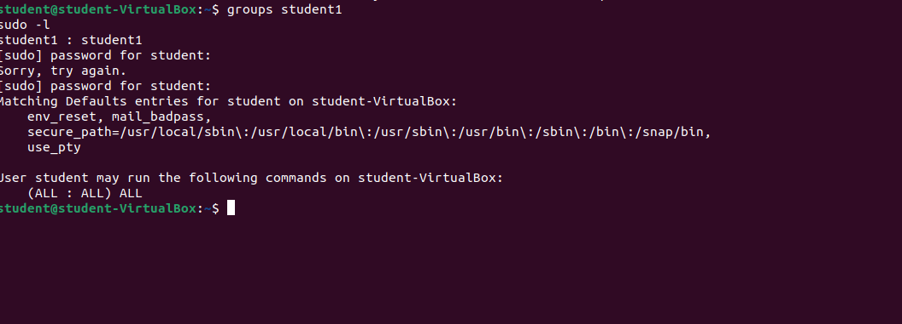

🎯 Week 4 – Secure Remote Access (SSH)
📌 Overview

This week focused on configuring secure remote access to an Ubuntu Server using OpenSSH. The objective was to enable remote administration while applying security hardening best practices, including SSH key authentication and disabling insecure login methods.

🌐 Network Configuration

The server was assigned an IP address via the primary network interface. This IP is required for remote SSH access.

🛠 Commands Used
ip a
hostname -I

📸 Evidence

🔐 SSH Service Setup

The OpenSSH server was verified to be installed, enabled at boot, and actively running.

🛠 Commands Used
sudo systemctl status ssh
sudo systemctl enable ssh

### 🔐 Sudo Privileges Check

---

🔑 SSH Key-Based Authentication

To improve security, an ED25519 SSH key pair was generated. Key-based authentication prevents brute-force password attacks.

🛠 Command Used
ssh-keygen -t ed25519 -C "cmpn202-key"

The public key was automatically stored in the ~/.ssh directory and added to authorized_keys.

📸 Evidence

🛡️ SSH Security Hardening

The SSH daemon configuration file was edited to restrict insecure authentication methods.

🔒 Security Changes Applied

✅ Public key authentication enabled

❌ Password authentication disabled

❌ Root login disabled

🛠 Configuration
PubkeyAuthentication yes
PasswordAuthentication no
PermitRootLogin no

🛠 Commands Used
sudo nano /etc/ssh/sshd_config
sudo systemctl restart ssh

📸 Evidence

💻 Remote SSH Login Test

A successful remote login was performed from the client machine using SSH keys, confirming that password authentication was disabled and the configuration was correct.

🛠 Command Used
ssh anwar35s@192.168.64.14

📸 Evidence

🧠 Reflection

This week highlighted the importance of secure remote access in server administration. Implementing SSH key-based authentication and disabling root and password logins significantly reduces attack vectors. These practices are essential for protecting production servers and form a strong foundation for future security enhancements.
