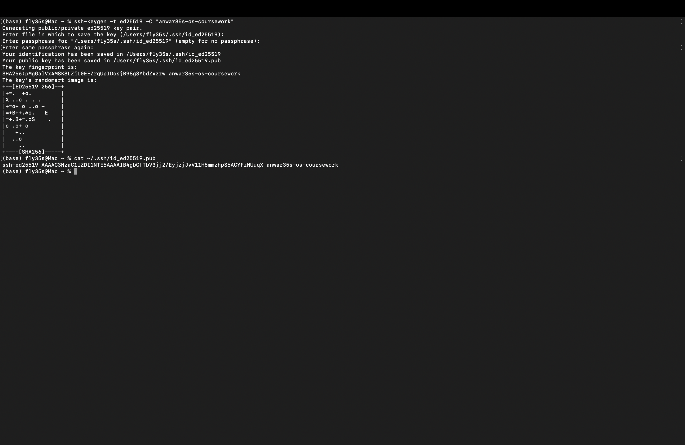
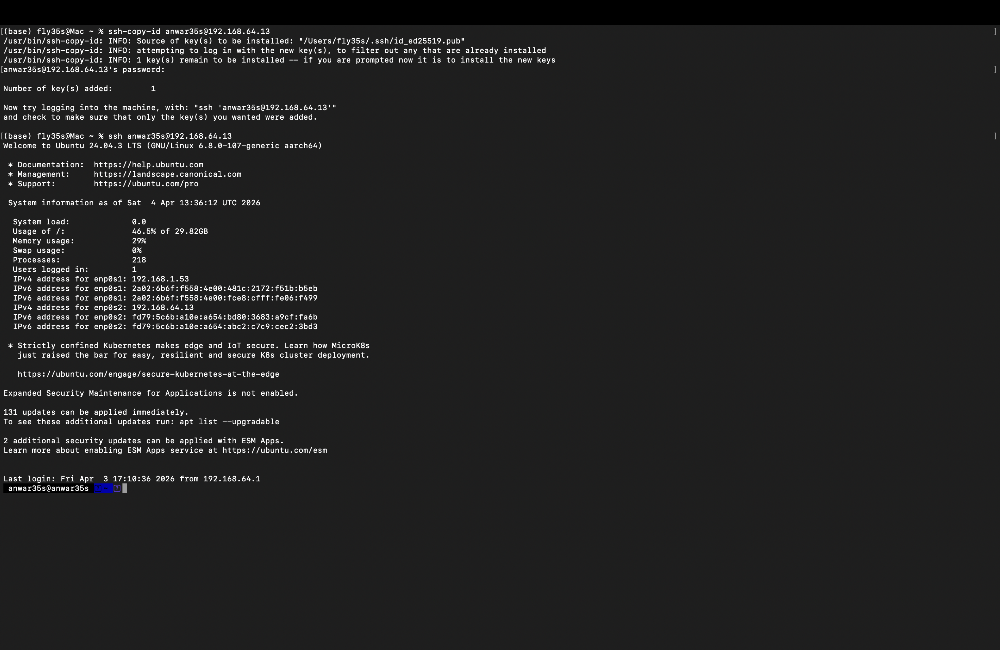
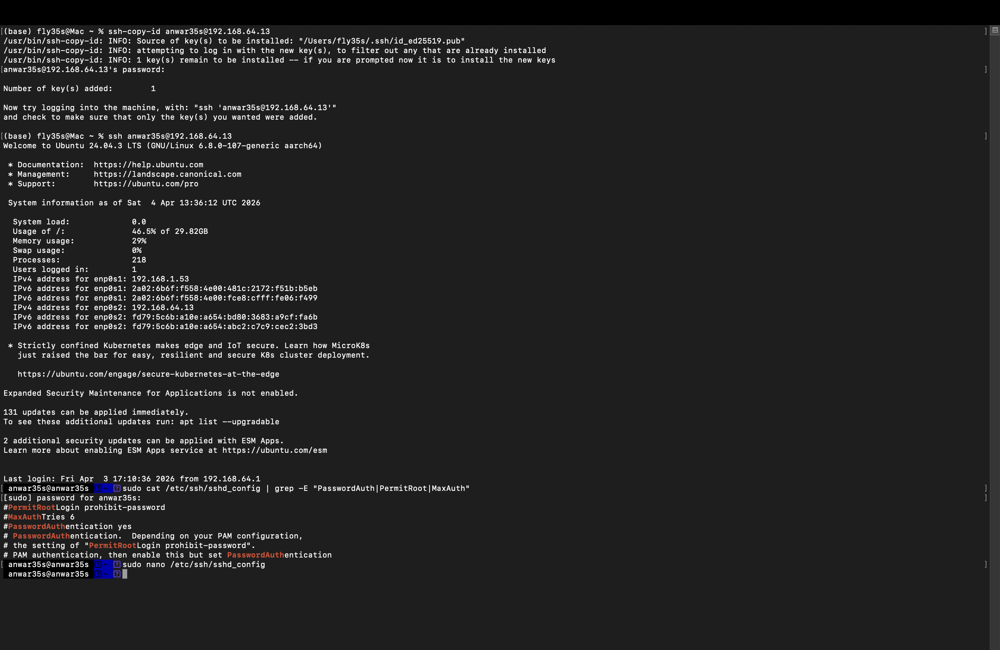
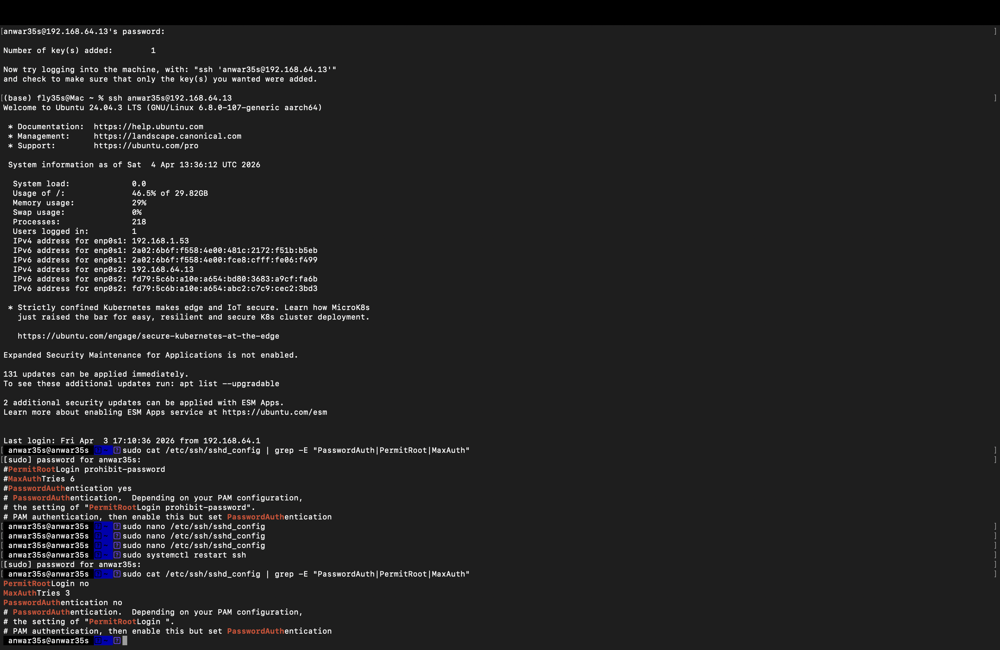
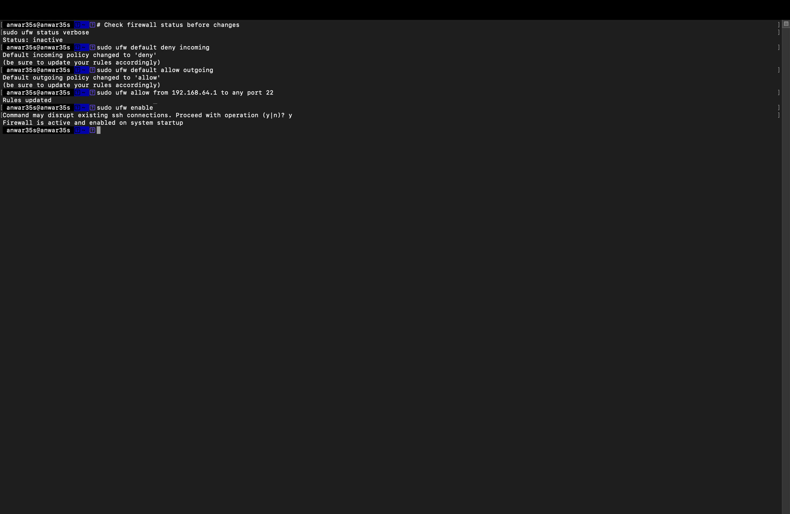
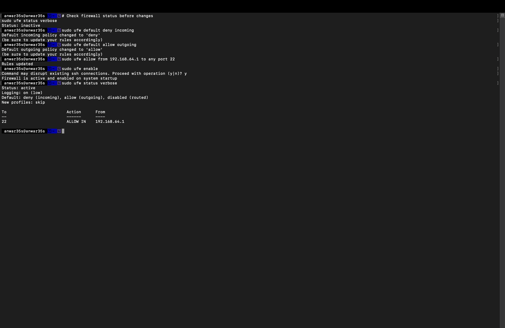
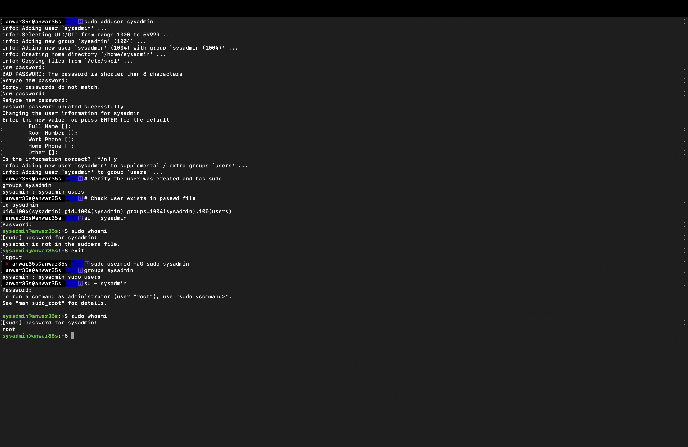

# Week 4 — Initial System Configuration & Security Implementation

**Navigation:** [Week 1](images/week1.md) | [Week 2](images/week2.md) | [Week 3](images/week3.md) | Week 4 | [Week 5](images/week5.md) | [Week 6](images/week6.md) | [Week 7](images/week7.md)

---

## Overview

In Week 4, I deployed foundational security controls on the Ubuntu Server. All configuration was performed remotely via SSH from my Mac workstation, enforcing the administrative constraint specified in the assessment brief. The four key deliverables completed this week are: SSH key-based authentication, firewall configuration, SSH hardening, and non-root user management.

---

## 1. SSH Key-Based Authentication

### Generating the SSH Key Pair

An ed25519 key pair was generated on the Mac workstation. Ed25519 was chosen over RSA as it provides stronger security with a shorter key length and is recommended by current cryptographic standards.
```bash
ssh-keygen -t ed25519 -C "anwar35s-os-coursework"
```



*Key pair generated and saved to `/Users/fly35s/.ssh/id_ed25519`. The randomart image confirms successful key creation. The comment `anwar35s-os-coursework` identifies the key's purpose.*

### Copying the Public Key to the Server
```bash
ssh-copy-id anwar35s@192.168.64.13
```



*The public key was installed successfully — "Number of key(s) added: 1". The subsequent `ssh anwar35s@192.168.64.13` command connected without a password prompt, confirming key-based authentication is working.*

---

## 2. SSH Hardening

### Configuration Before Changes
```bash
sudo cat /etc/ssh/sshd_config | grep -E "PasswordAuth|PermitRoot|MaxAuth"
```



*Before hardening, all three settings were commented out (prefixed with `#`), meaning default values applied: `PasswordAuthentication yes`, `PermitRootLogin prohibit-password`, and `MaxAuthTries 6`. These defaults are insecure for a production server.*

### Changes Made

Using `sudo nano /etc/ssh/sshd_config`, the following three lines were uncommented and updated:

| Setting | Before | After | Reason |
|---|---|---|---|
| `PasswordAuthentication` | `yes` (default) | `no` | Forces key-only authentication, eliminates brute force password attacks |
| `PermitRootLogin` | `prohibit-password` | `no` | Prevents any root login via SSH, forces use of sudo |
| `MaxAuthTries` | `6` (default) | `3` | Reduces window for authentication attempts |
```bash
sudo systemctl restart ssh
```

### Configuration After Changes
```bash
sudo cat /etc/ssh/sshd_config | grep -E "PasswordAuth|PermitRoot|MaxAuth"
```



*All three settings are now active without `#` comments: `PermitRootLogin no`, `MaxAuthTries 3`, `PasswordAuthentication no`. SSH service was restarted to apply changes.*

---

## 3. Firewall Configuration

### Status Before Configuration
```bash
sudo ufw status verbose
```

*Before configuration: Status was inactive — no firewall rules in place, all ports accessible.*

### Firewall Rules Applied
```bash
# Set default policies
sudo ufw default deny incoming
sudo ufw default allow outgoing

# Allow SSH only from Mac workstation
sudo ufw allow from 192.168.64.1 to any port 22

# Enable the firewall
sudo ufw enable
```



### Final Firewall Ruleset
```bash
sudo ufw status verbose
```



*Final ruleset confirms:*
- *Status: active — enabled on system startup*
- *Default: deny (incoming), allow (outgoing)*
- *Rule: port 22 ALLOW IN from 192.168.64.1 only*

*This configuration means only my Mac workstation (192.168.64.1) can reach the server via SSH. Any other IP attempting to connect will be silently dropped by the firewall.*

### Firewall Rule Justification

| Rule | Justification |
|---|---|
| Default deny incoming | Blocks all unsolicited inbound connections — principle of least privilege |
| Allow SSH from 192.168.64.1 | Permits only the specific workstation IP, eliminating exposure to other network hosts |
| Allow outgoing | Permits server to make outbound connections for updates and package installation |

---

## 4. User Privilege Management

### Creating a Non-Root Administrative User

A dedicated administrative user `sysadmin` was created as a non-root account with sudo privileges. Running daily administration as a non-root user limits the blast radius of any mistakes or compromises.
```bash
sudo adduser sysadmin
sudo usermod -aG sudo sysadmin
```

### Verification
```bash
groups sysadmin
id sysadmin
su - sysadmin
sudo whoami
```



*Evidence from screenshot confirms:*
- *`sysadmin` created with UID 1004, home directory `/home/sysadmin`*
- *`groups sysadmin` output: `sysadmin : sysadmin sudo users` — sudo group membership confirmed*
- *`sudo whoami` returns `root` — sudo privileges working correctly*

### User Security Summary

| Setting | Value | Justification |
|---|---|---|
| Username | `sysadmin` | Generic admin name, not tied to personal identity |
| UID | 1004 | Non-system user range (1000–59999) |
| Groups | sysadmin, sudo, users | Sudo access without being root |
| Shell | `/bin/bash` | Standard interactive shell |
| Home directory | `/home/sysadmin` | Isolated from other users |

---

## 5. Remote Administration Evidence

All server configurations in Week 4 were performed exclusively via SSH from the Mac workstation (`fly35s@Mac`). No direct server console access was used. The screenshots throughout this page show the Mac prompt `fly35s@Mac` initiating connections and the server prompt `anwar35s@anwar35s` confirming remote execution.

Key remote commands executed this week:
```bash
# From Mac workstation
ssh-keygen -t ed25519 -C "anwar35s-os-coursework"
ssh-copy-id anwar35s@192.168.64.13
ssh anwar35s@192.168.64.13

# On server via SSH
sudo cat /etc/ssh/sshd_config | grep -E "PasswordAuth|PermitRoot|MaxAuth"
sudo nano /etc/ssh/sshd_config
sudo systemctl restart ssh
sudo ufw default deny incoming
sudo ufw default allow outgoing
sudo ufw allow from 192.168.64.1 to any port 22
sudo ufw enable
sudo ufw status verbose
sudo adduser sysadmin
sudo usermod -aG sudo sysadmin
groups sysadmin
id sysadmin
```

---

## 6. Security Configuration Summary

| Control | Status | Evidence |
|---|---|---|
| SSH key-based authentication | ✅ Implemented | Passwordless login screenshot |
| Password authentication disabled | ✅ Implemented | sshd_config after screenshot |
| Root login disabled | ✅ Implemented | sshd_config after screenshot |
| MaxAuthTries set to 3 | ✅ Implemented | sshd_config after screenshot |
| UFW firewall active | ✅ Implemented | ufw status verbose screenshot |
| SSH restricted to workstation IP | ✅ Implemented | UFW ruleset screenshot |
| Non-root admin user created | ✅ Implemented | User management screenshot |
| Sudo access verified | ✅ Implemented | sudo whoami = root screenshot |

---

## 7. Reflection

Implementing SSH key authentication before disabling password authentication was a critical ordering decision — doing it the other way round would have locked me out of the server entirely. This highlights an important principle in security hardening: always ensure you have a working alternative access method before removing an existing one.

The firewall configuration restricting SSH to a single IP address (192.168.64.1) is a strong control but introduces a trade-off — if my Mac's IP address changes (e.g. after a DHCP renewal), I would lose SSH access until the rule is updated. In a production environment, this would be managed through static IP assignment or VPN access.

Creating a dedicated `sysadmin` user rather than using the primary `anwar35s` account follows the principle of least privilege — separating personal and administrative identities reduces the risk of accidental privilege misuse.

---

## References

[1] OpenSSH, "OpenSSH Manual Pages," 2024. [Online]. Available: https://www.openssh.com/manual.html [Accessed: 4 Apr. 2026].

[2] Canonical Ltd., "UFW - Uncomplicated Firewall," *Ubuntu Documentation*, 2024. [Online]. Available: https://help.ubuntu.com/community/UFW [Accessed: 4 Apr. 2026].

[3] Center for Internet Security, "CIS Ubuntu Linux 24.04 LTS Benchmark," 2024. [Online]. Available: https://www.cisecurity.org/benchmark/ubuntu_linux [Accessed: 4 Apr. 2026].
