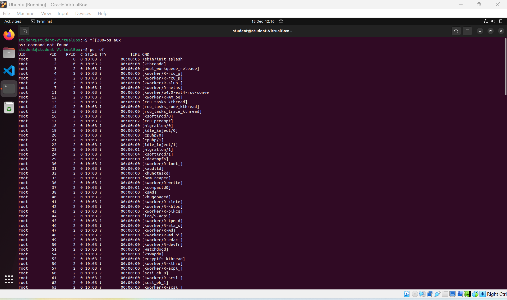
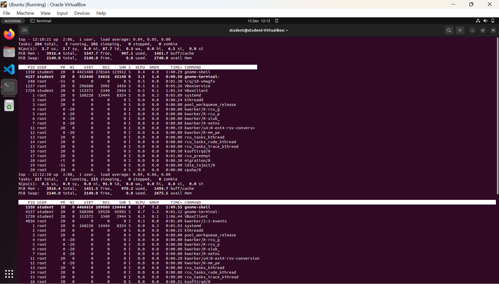
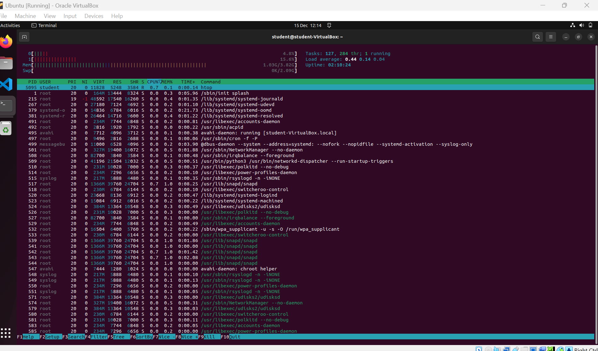
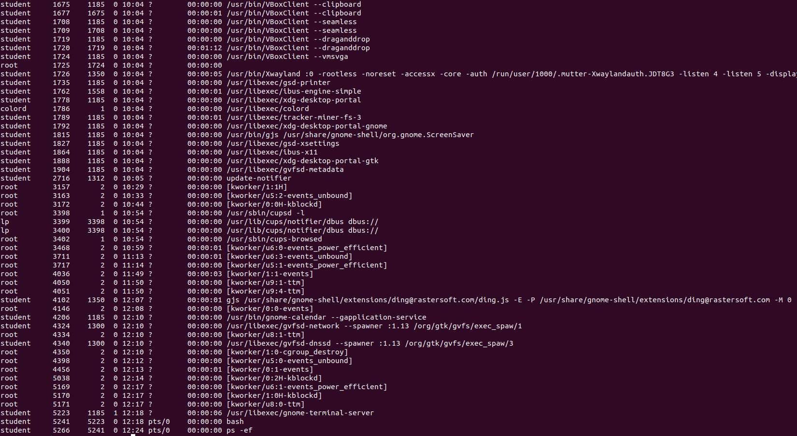

# 🧠 Week 5 – Process Monitoring and Management

## 📌 Overview

This week focused on understanding how Linux manages running processes. We explored how to:

- List and inspect active processes
- Start background jobs
- Terminate specific processes using `kill` and `killall`
- Monitor system resource usage with tools like `ps`, `top`, and `htop`

---

## 🔍 Step 1: Viewing All Processes with `ps`

We used the `ps -ef` command to display all active system processes.

### 🖼️ Screenshot:

---

## 📈 Step 2: Using `top` to Monitor Processes in Real Time

The `top` command gives a live overview of resource usage by each process.

### 🖼️ Screenshot:

---

## 📊 Step 3: Using `htop` (Improved Process Viewer)

`htop` provides a colorful, interactive process viewer that allows navigation and killing processes with the keyboard.

> Installed via:  
> `sudo apt install htop`

### 🖼️ Screenshot:

---

## 📊 Step 4: Creating a Long-Running Background Process

We simulated a long-running background process using the sleep command:

sleep 1000 &

This command runs in the background and returns a Process ID (PID), which can later be managed.

### 🖼️ Screenshot:

## 📊 Step 5: Terminating the Process Using kill
The running sleep process was identified using:

ps aux | grep sleep

Once the PID (5256) was confirmed, the process was terminated using:

kill 5256

Alternatively, the process was also terminated by name:

killall sleep

## 📊 Step 6: Verifying the Process Has Been Terminated

To confirm the process was successfully stopped, the following command was run again:

ps aux | grep sleep

The output showed that the sleep process was no longer running.

