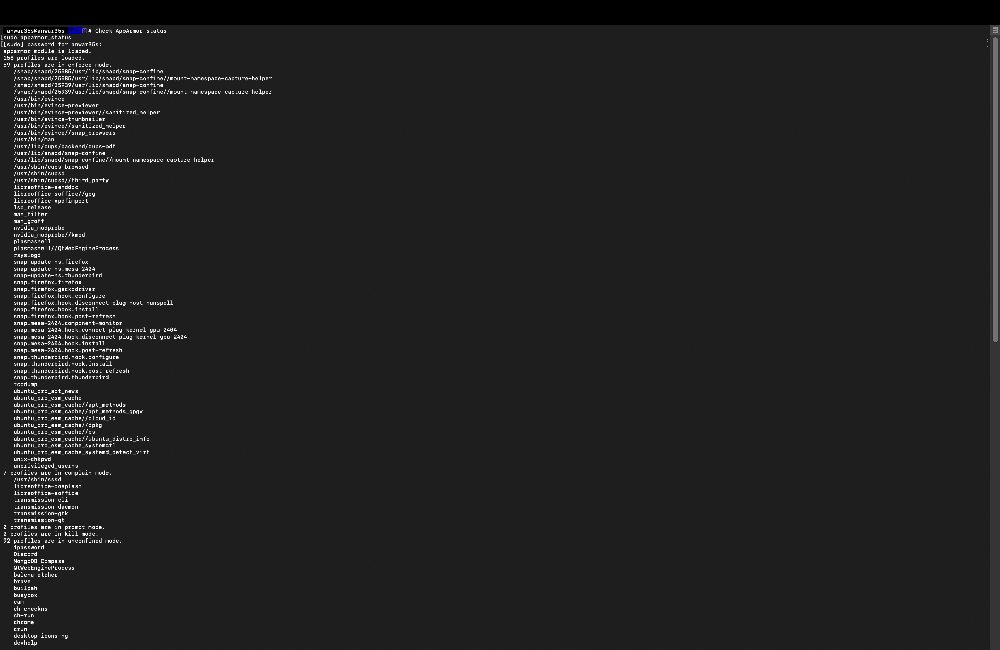
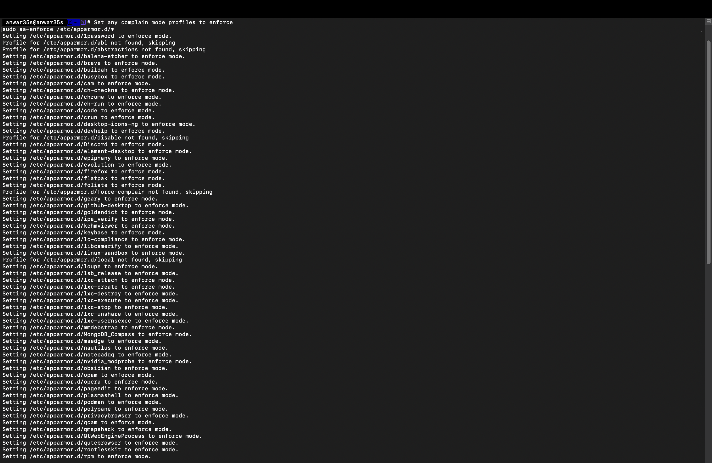
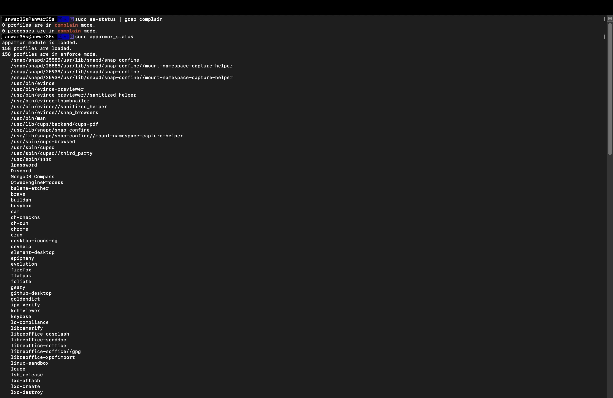
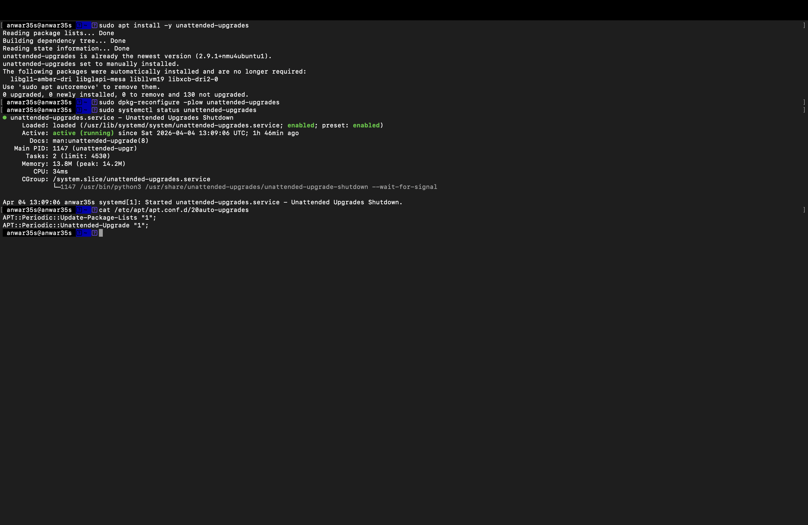
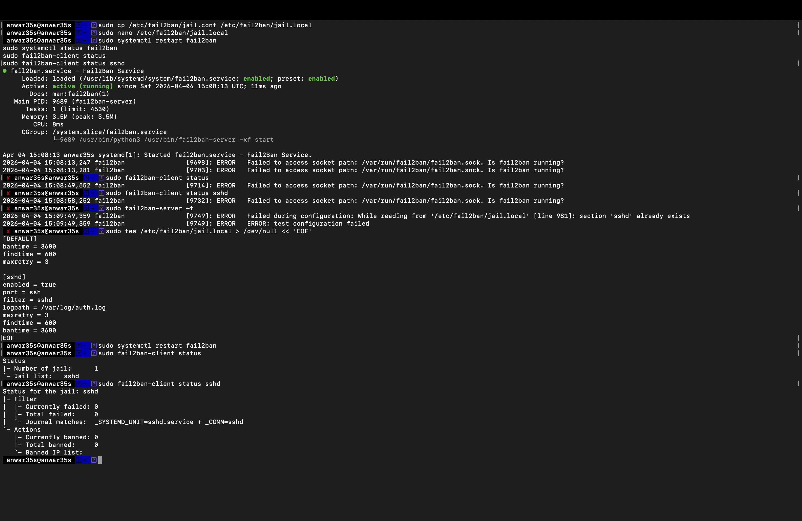
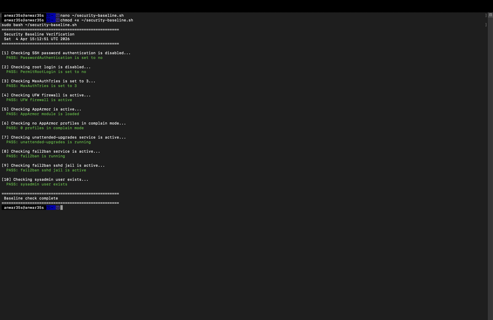
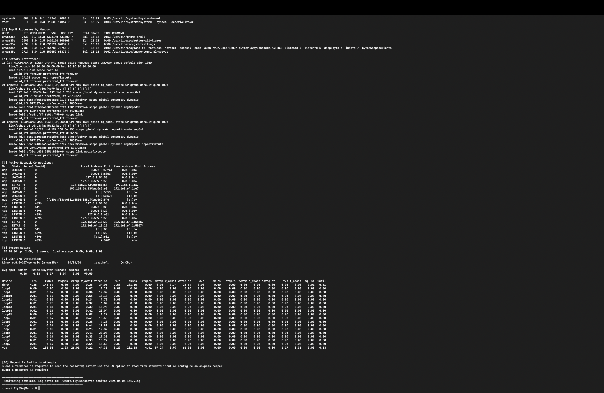

# Week 5 — Advanced Security and Monitoring Infrastructure

**Navigation:** [Week 1](images/week1.md) | [Week 2](images/week2.md) | [Week 3](images/week3.md) | [Week 4](images/week4.md) | Week 5 | [Week 6](images/week6.md) | [Week 7](images/week7.md)

---

## Overview

In Week 5, I implemented advanced security controls including AppArmor mandatory access control, automatic security updates, and fail2ban intrusion detection. I also developed two scripts: `security-baseline.sh` which verifies all security configurations from Phases 4 and 5, and `monitor-server.sh` which runs on the Mac workstation and collects performance metrics from the server via SSH.

---

## 1. AppArmor Mandatory Access Control

### Status Before Changes
```bash
sudo apparmor_status
sudo aa-status | grep complain
```



*Before intervention: 66 profiles loaded, 59 in enforce mode, 7 profiles in complain mode. Complain mode means the profile logs violations but does not block them — this is less secure than enforce mode.*

### Setting All Profiles to Enforce Mode
```bash
# Install apparmor-utils to get the aa-enforce command
sudo apt install -y apparmor-utils

# Set all profiles in /etc/apparmor.d/ to enforce mode
sudo aa-enforce /etc/apparmor.d/*
```



*All profiles processed — each line confirms "Setting [profile] to enforce mode". Some profiles were skipped where the binary was not found on this system.*

### Status After Changes
```bash
sudo aa-status | grep complain
sudo apparmor_status
```



*After intervention: 158 profiles loaded, all 158 in enforce mode, 0 profiles in complain mode. AppArmor is now fully enforcing mandatory access control across all loaded profiles.*

### AppArmor Before vs After

| Metric | Before | After |
|---|---|---|
| Profiles loaded | 66 | 158 |
| Enforce mode | 59 | 158 |
| Complain mode | 7 | 0 |
| Kill mode | 0 | 0 |

---

## 2. Automatic Security Updates
```bash
# Install unattended-upgrades package
sudo apt install -y unattended-upgrades

# Configure to enable automatic upgrades
sudo dpkg-reconfigure -plow unattended-upgrades

# Verify the service is running
sudo systemctl status unattended-upgrades

# Confirm configuration file settings
cat /etc/apt/apt.conf.d/20auto-upgrades
```



*unattended-upgrades 2.9.1 was already installed. The service is active (running) since 13:09 UTC. The configuration file confirms:*
- *`APT::Periodic::Update-Package-Lists "1"` — package lists updated daily*
- *`APT::Periodic::Unattended-Upgrade "1"` — security upgrades applied automatically*

*This directly addresses the 131 pending updates noted at initial login — security patches will now be applied automatically without manual intervention.*

---

## 3. fail2ban Intrusion Detection

### Installation and Configuration
```bash
# Install fail2ban
sudo apt install -y fail2ban

# Create local config file - never edit jail.conf directly
# as it gets overwritten on updates
sudo tee /etc/fail2ban/jail.local > /dev/null << 'EOF'
[DEFAULT]
bantime = 3600
findtime = 600
maxretry = 3

[sshd]
enabled = true
port = ssh
filter = sshd
logpath = /var/log/auth.log
maxretry = 3
findtime = 600
bantime = 3600
EOF

# Enable and start fail2ban
sudo systemctl enable fail2ban
sudo systemctl restart fail2ban
```

### Verification
```bash
sudo systemctl status fail2ban
sudo fail2ban-client status
sudo fail2ban-client status sshd
```



*fail2ban is active (running) with 1 active jail — sshd. Configuration:*
- *maxretry: 3 — ban after 3 failed attempts*
- *findtime: 600 seconds — within a 10 minute window*
- *bantime: 3600 seconds — ban lasts 1 hour*
- *Currently banned: 0 — no active bans (system is secure)*

### fail2ban Configuration Justification

| Setting | Value | Justification |
|---|---|---|
| maxretry | 3 | Matches MaxAuthTries in sshd_config — consistent policy |
| findtime | 600s | 10 minute window catches slow brute force attacks |
| bantime | 3600s | 1 hour ban discourages persistent attackers |

---

## 4. Security Baseline Verification Script

The `security-baseline.sh` script runs on the server via SSH and verifies all security configurations from Phases 4 and 5. Every line is commented to explain its function.

### Script: security-baseline.sh
```bash
#!/bin/bash
# security-baseline.sh
# Runs on the server via SSH to verify all security configurations from Phases 4 and 5
# Author: anwar35s | CMPN202 Operating Systems Coursework

# Define colour codes for pass/fail output
GREEN='\033[0;32m'  # Green colour for pass
RED='\033[0;31m'    # Red colour for fail
NC='\033[0m'        # No colour - reset to default

# Print script header with timestamp
echo "=================================================="
echo " Security Baseline Verification"
echo " $(date)"
echo "=================================================="

# --- CHECK 1: SSH key authentication enabled ---
echo ""
echo "[1] Checking SSH password authentication is disabled..."
# Grep the sshd_config for the PasswordAuthentication setting
if sudo grep -q "^PasswordAuthentication no" /etc/ssh/sshd_config; then
    echo -e "${GREEN}  PASS: PasswordAuthentication is set to no${NC}"
else
    echo -e "${RED}  FAIL: PasswordAuthentication is not disabled${NC}"
fi

# --- CHECK 2: Root login disabled ---
echo ""
echo "[2] Checking root login is disabled..."
# Grep the sshd_config for the PermitRootLogin setting
if sudo grep -q "^PermitRootLogin no" /etc/ssh/sshd_config; then
    echo -e "${GREEN}  PASS: PermitRootLogin is set to no${NC}"
else
    echo -e "${RED}  FAIL: PermitRootLogin is not disabled${NC}"
fi

# --- CHECK 3: MaxAuthTries set to 3 ---
echo ""
echo "[3] Checking MaxAuthTries is set to 3..."
# Grep the sshd_config for the MaxAuthTries setting
if sudo grep -q "^MaxAuthTries 3" /etc/ssh/sshd_config; then
    echo -e "${GREEN}  PASS: MaxAuthTries is set to 3${NC}"
else
    echo -e "${RED}  FAIL: MaxAuthTries is not set to 3${NC}"
fi

# --- CHECK 4: UFW firewall is active ---
echo ""
echo "[4] Checking UFW firewall is active..."
# Use ufw status and check if the word 'active' appears
if sudo ufw status | grep -q "Status: active"; then
    echo -e "${GREEN}  PASS: UFW firewall is active${NC}"
else
    echo -e "${RED}  FAIL: UFW firewall is not active${NC}"
fi

# --- CHECK 5: AppArmor is active and enforcing ---
echo ""
echo "[5] Checking AppArmor is active..."
# Check if apparmor module is loaded using aa-status
if sudo aa-status | grep -q "apparmor module is loaded"; then
    echo -e "${GREEN}  PASS: AppArmor module is loaded${NC}"
else
    echo -e "${RED}  FAIL: AppArmor is not loaded${NC}"
fi

# --- CHECK 6: No profiles in complain mode ---
echo ""
echo "[6] Checking no AppArmor profiles in complain mode..."
# Count profiles in complain mode - should be 0
COMPLAIN=$(sudo aa-status | grep "profiles are in complain mode" | awk '{print $1}')
if [ "$COMPLAIN" -eq 0 ]; then
    echo -e "${GREEN}  PASS: 0 profiles in complain mode${NC}"
else
    echo -e "${RED}  FAIL: ${COMPLAIN} profiles still in complain mode${NC}"
fi

# --- CHECK 7: Unattended upgrades is running ---
echo ""
echo "[7] Checking unattended-upgrades service is active..."
# Use systemctl to check service status
if systemctl is-active --quiet unattended-upgrades; then
    echo -e "${GREEN}  PASS: unattended-upgrades is running${NC}"
else
    echo -e "${RED}  FAIL: unattended-upgrades is not running${NC}"
fi

# --- CHECK 8: fail2ban is running ---
echo ""
echo "[8] Checking fail2ban service is active..."
# Use systemctl to check fail2ban status
if systemctl is-active --quiet fail2ban; then
    echo -e "${GREEN}  PASS: fail2ban is running${NC}"
else
    echo -e "${RED}  FAIL: fail2ban is not running${NC}"
fi

# --- CHECK 9: fail2ban sshd jail is active ---
echo ""
echo "[9] Checking fail2ban sshd jail is active..."
# Use fail2ban-client to check if sshd jail exists
if sudo fail2ban-client status | grep -q "sshd"; then
    echo -e "${GREEN}  PASS: fail2ban sshd jail is active${NC}"
else
    echo -e "${RED}  FAIL: fail2ban sshd jail is not active${NC}"
fi

# --- CHECK 10: Non-root admin user exists ---
echo ""
echo "[10] Checking sysadmin user exists..."
# Check /etc/passwd for the sysadmin user
if id "sysadmin" &>/dev/null; then
    echo -e "${GREEN}  PASS: sysadmin user exists${NC}"
else
    echo -e "${RED}  FAIL: sysadmin user does not exist${NC}"
fi

# Print summary footer
echo ""
echo "=================================================="
echo " Baseline check complete"
echo "=================================================="
```

### Script Execution Evidence
```bash
chmod +x ~/security-baseline.sh
sudo bash ~/security-baseline.sh
```



*All 10 checks passed — 10/10 PASS. Every security control from Phases 4 and 5 is correctly configured and active.*

---

## 5. Remote Monitoring Script

The `monitor-server.sh` script runs on the Mac workstation, connects via SSH, and collects 10 performance metrics from the server. The log is saved to a timestamped file for later analysis in Week 6.

### Script: monitor-server.sh
```bash
#!/bin/bash
# monitor-server.sh
# Runs on the Mac workstation, connects via SSH to the server,
# and collects performance metrics remotely
# Author: anwar35s | CMPN202 Operating Systems Coursework

# Define the server connection details
SERVER="anwar35s@192.168.64.13"  # SSH user and server IP address
LOGFILE=~/server-monitor-$(date +%F-%H%M).log  # Log file with timestamp in filename

# Print header to both screen and log file
echo "=================================================" | tee "$LOGFILE"
echo " Remote Server Monitor" | tee -a "$LOGFILE"
echo " Target: $SERVER" | tee -a "$LOGFILE"
echo " $(date)" | tee -a "$LOGFILE"
echo "=================================================" | tee -a "$LOGFILE"

# --- METRIC 1: CPU and load average ---
echo "" | tee -a "$LOGFILE"
echo "[1] CPU Usage and Load Average:" | tee -a "$LOGFILE"
# SSH into server and run top in batch mode, show first 5 lines
ssh "$SERVER" "top -bn1 | head -5" | tee -a "$LOGFILE"

# --- METRIC 2: Memory usage ---
echo "" | tee -a "$LOGFILE"
echo "[2] Memory Usage:" | tee -a "$LOGFILE"
# SSH into server and run free with human-readable output
ssh "$SERVER" "free -h" | tee -a "$LOGFILE"

# --- METRIC 3: Disk usage ---
echo "" | tee -a "$LOGFILE"
echo "[3] Disk Usage:" | tee -a "$LOGFILE"
# SSH into server and run df showing all filesystems in human-readable format
ssh "$SERVER" "df -h" | tee -a "$LOGFILE"

# --- METRIC 4: Top 5 CPU-consuming processes ---
echo "" | tee -a "$LOGFILE"
echo "[4] Top 5 Processes by CPU:" | tee -a "$LOGFILE"
# SSH into server, list processes sorted by CPU usage, show top 5
ssh "$SERVER" "ps aux --sort=-%cpu | head -6" | tee -a "$LOGFILE"

# --- METRIC 5: Top 5 memory-consuming processes ---
echo "" | tee -a "$LOGFILE"
echo "[5] Top 5 Processes by Memory:" | tee -a "$LOGFILE"
# SSH into server, list processes sorted by memory usage, show top 5
ssh "$SERVER" "ps aux --sort=-%mem | head -6" | tee -a "$LOGFILE"

# --- METRIC 6: Network interfaces and IP addresses ---
echo "" | tee -a "$LOGFILE"
echo "[6] Network Interfaces:" | tee -a "$LOGFILE"
# SSH into server and show IP addresses for all interfaces
ssh "$SERVER" "ip addr show" | tee -a "$LOGFILE"

# --- METRIC 7: Active network connections ---
echo "" | tee -a "$LOGFILE"
echo "[7] Active Network Connections:" | tee -a "$LOGFILE"
# SSH into server and show all TCP/UDP connections with process names
ssh "$SERVER" "ss -tunap" | tee -a "$LOGFILE"

# --- METRIC 8: System uptime ---
echo "" | tee -a "$LOGFILE"
echo "[8] System Uptime:" | tee -a "$LOGFILE"
# SSH into server and show how long the system has been running
ssh "$SERVER" "uptime" | tee -a "$LOGFILE"

# --- METRIC 9: Disk I/O statistics ---
echo "" | tee -a "$LOGFILE"
echo "[9] Disk I/O Statistics:" | tee -a "$LOGFILE"
# SSH into server and run iostat showing extended stats
ssh "$SERVER" "iostat -x" | tee -a "$LOGFILE"

# --- METRIC 10: Failed login attempts ---
echo "" | tee -a "$LOGFILE"
echo "[10] Recent Failed Login Attempts:" | tee -a "$LOGFILE"
# SSH into server and check auth log for failed attempts
ssh "$SERVER" "sudo grep 'Failed password\|authentication failure' /var/log/auth.log | tail -5" | tee -a "$LOGFILE"

# Print footer
echo "" | tee -a "$LOGFILE"
echo "=================================================" | tee -a "$LOGFILE"
echo " Monitoring complete. Log saved to: $LOGFILE" | tee -a "$LOGFILE"
echo "=================================================" | tee -a "$LOGFILE"
```

### Script Execution Evidence
```bash
# Run from Mac workstation
bash ~/monitor-server.sh
```



*Script executed successfully from Mac workstation (`fly35s@Mac`). All 10 metrics collected remotely via SSH including CPU load, memory usage, disk usage, top processes, network interfaces, active connections, uptime, and disk I/O statistics. Output saved to timestamped log file `/Users/fly35s/server-monitor-2026-04-04-1617.log`.*

*Note: Metric 10 (failed login attempts) requires interactive sudo — this will be addressed in Week 7 by configuring passwordless sudo for specific log reading commands.*

---

## 6. Security Implementation Summary

| Control | Tool | Status | Evidence |
|---|---|---|---|
| Mandatory access control | AppArmor | ✅ 158 profiles enforcing | apparmor_status screenshot |
| Automatic security updates | unattended-upgrades | ✅ Active and running | systemctl status screenshot |
| Intrusion detection | fail2ban | ✅ sshd jail active | fail2ban-client status screenshot |
| Security verification | security-baseline.sh | ✅ 10/10 PASS | Script output screenshot |
| Remote monitoring | monitor-server.sh | ✅ 10 metrics collected | Script output screenshot |

---

## 7. Reflection

The fail2ban configuration required troubleshooting — the initial approach of copying jail.conf and editing it created a duplicate `[sshd]` section which prevented the service from starting. This was resolved by replacing jail.local with a minimal clean configuration file containing only the necessary settings. This highlighted an important lesson: configuration files should be kept as minimal as possible, with only the settings that differ from defaults explicitly stated.

The security baseline script achieving 10/10 passes provides confidence that all Phase 4 and 5 controls are correctly implemented. Running this script at the start of each session is good practice to detect any configuration drift.

The monitor script demonstrated a key principle of remote server administration — all metrics can be collected without ever opening a direct console session, by chaining SSH commands. The timestamped log file means monitoring data is preserved for trend analysis in Week 6.

---

## References

[1] Canonical Ltd., "AppArmor," *Ubuntu Documentation*, 2024. [Online]. Available: https://help.ubuntu.com/community/AppArmor [Accessed: 4 Apr. 2026].

[2] Canonical Ltd., "Automatic Updates," *Ubuntu Server Guide*, 2024. [Online]. Available: https://help.ubuntu.com/lts/serverguide/automatic-updates.html [Accessed: 4 Apr. 2026].

[3] fail2ban, "fail2ban Documentation," 2024. [Online]. Available: https://www.fail2ban.org/wiki/index.php/Main_Page [Accessed: 4 Apr. 2026].
