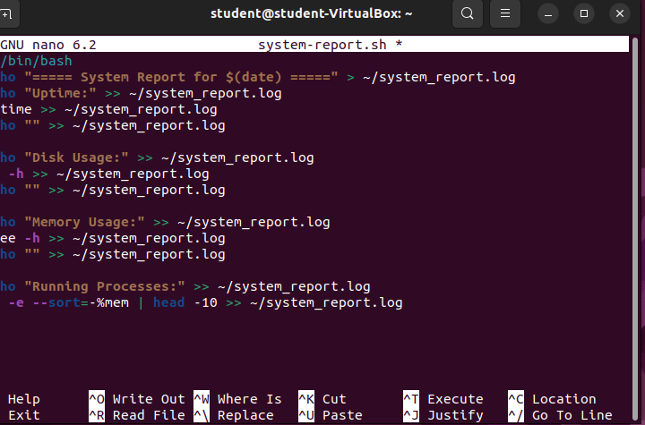

# 🧠 Week 6 – Automation with Scripts and Cron Jobs

## 📌 Overview

This week focused on **automating routine system tasks** using **Bash scripts** and **`cron` job scheduling**. We wrote scripts to collect system metrics and back up the home directory, ensured they were executable, and scheduled them with `crontab`. This practical application improves system administration efficiency and reliability.

---

## ⚙️ Step 1: Creating `system-report.sh`

We created a shell script named `system-report.sh` that collects and logs:

- Uptime
- Disk usage
- Memory usage
- Running processes

📜 **Sample commands in the script**:
```bash
#!/bin/bash
echo "===== System Report for $(date) =====" > ~/system_report.log
echo "Uptime:" >> ~/system_report.log
uptime >> ~/system_report.log
echo "Disk Usage:" >> ~/system_report.log
df -h >> ~/system_report.log
echo "Memory Usage:" >> ~/system_report.log
free -h >> ~/system_report.log
echo "Running Processes:" >> ~/system_report.log
ps -eo pid,ppid,cmd,%mem,%cpu --sort=-%mem | head -10 >> ~/system_report.log


### 🖼️ Screenshot:



---

🧪 Step 2: Executing the Script
We used chmod +x to grant execute permissions and ran the script.

❌ Initial error (missing permission):


✅ After fixing permission:
bash
Copy code
chmod +x system-report.sh
./system-report.sh


📋 Step 3: Creating backup-home.sh
We created a backup script that compresses the user's home directory into a .tar.gz file stored under ~/backups.

📜 Script excerpt:
bash
Copy code
#!/bin/bash
mkdir -p ~/backups
tar -czvf ~/backups/home_backup_$(date +%F).tar.gz ~/
📸 Screenshot:


🔁 Step 4: Scheduling with cron
We scheduled both scripts using crontab -e. The cron jobs automate script execution at set intervals.

🧾 Crontab entry (example):
cron
Copy code
0 * * * * /home/student/system-report.sh
30 1 * * * /home/student/backup-home.sh
📸 Screenshot of crontab -e command:


🧾 Step 5: Viewing Crontab Execution Output
We verified if the cron jobs executed correctly by checking output files and cron logs.

📸 Cron output in terminal:


📸 Viewing Cron logs:


🧾 Step 6: Verifying Output Files
We used ls -lh to inspect the contents of ~/backups and confirm the presence of the generated .tar.gz file and system_report.log.

📸 Screenshot:


🧠 Reflection
This week solidified my understanding of automating system tasks using shell scripting and cron scheduling. Writing custom scripts and controlling when they run using cron is an essential skill for any system administrator. I also learned the importance of handling script permissions, validating execution via logs, and organizing output files.

These skills help in maintaining efficient and secure systems and reduce manual workload significantly.
