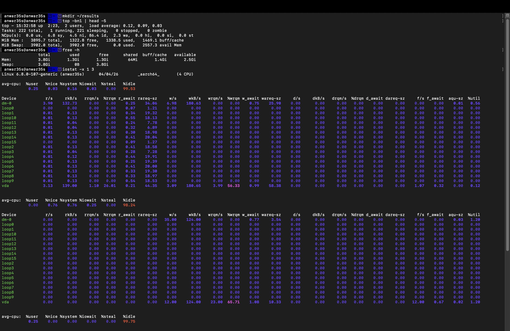
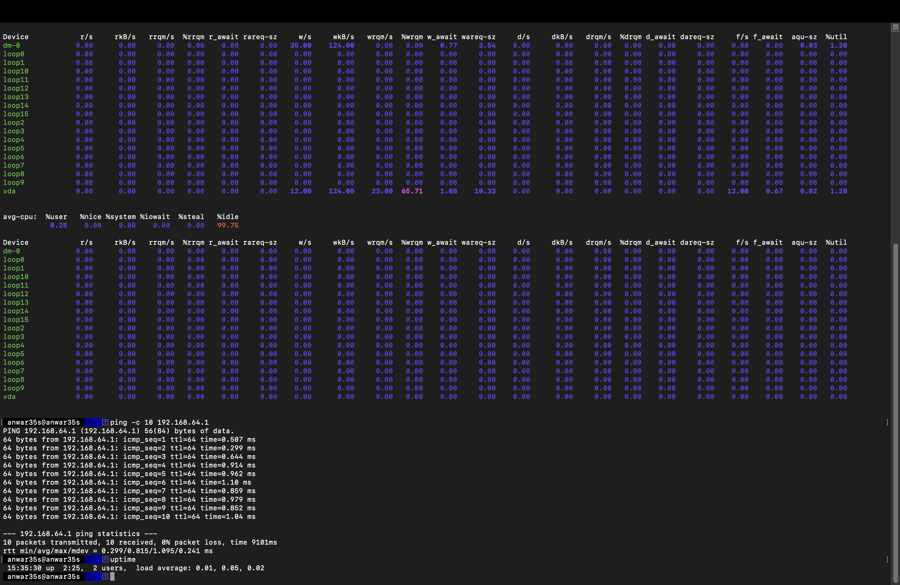
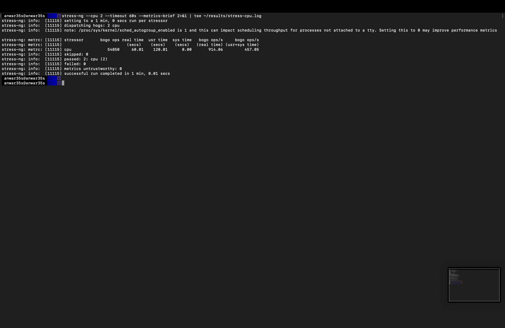
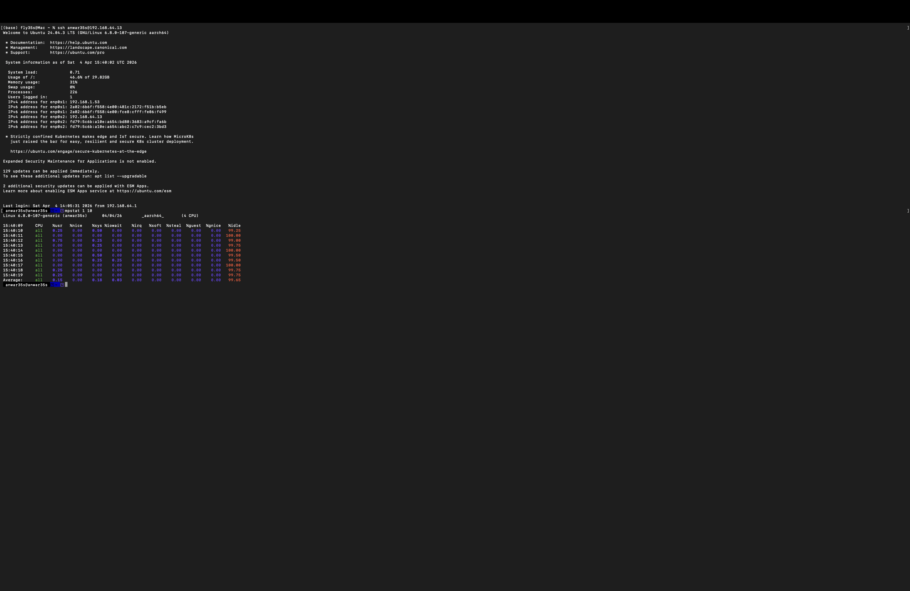
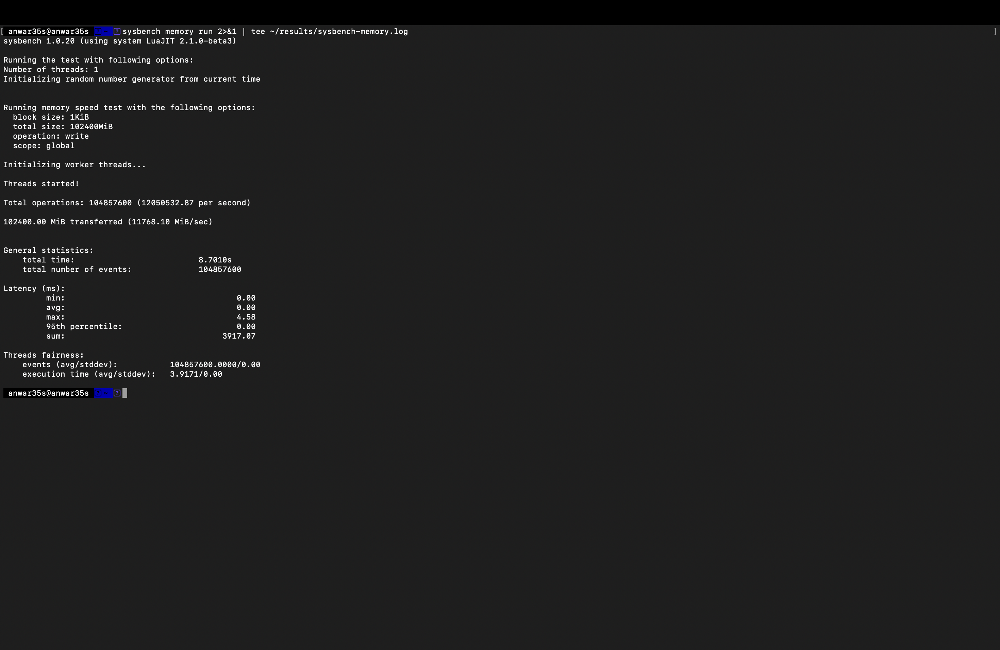
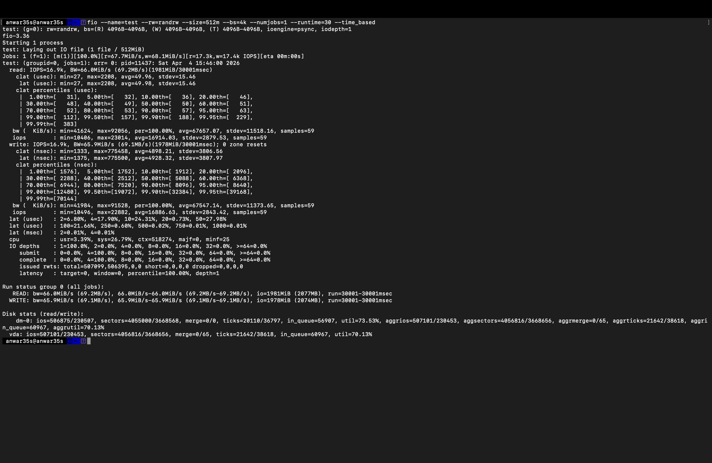
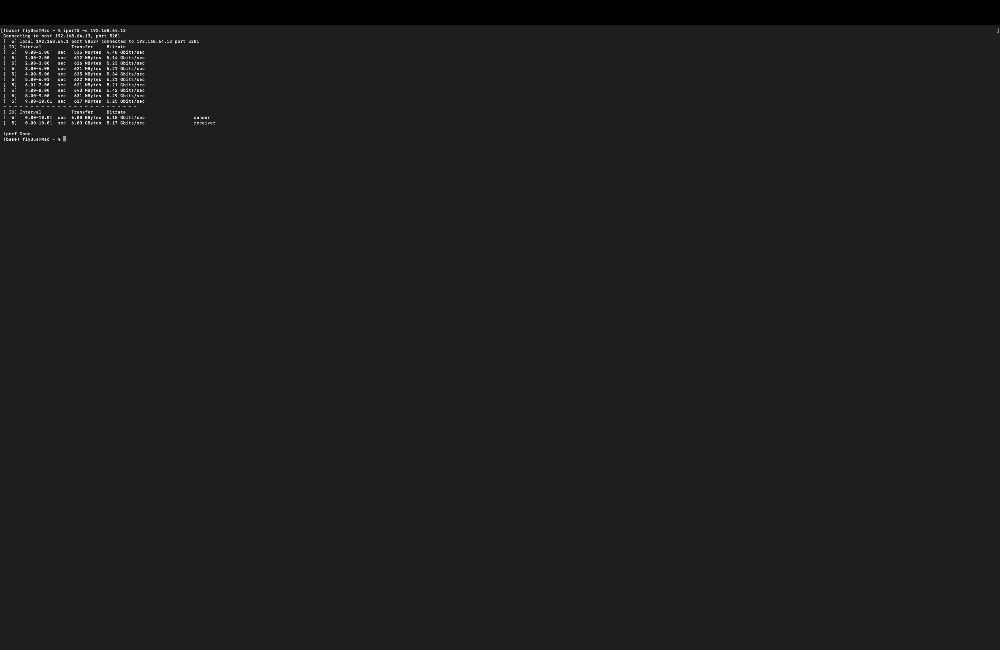
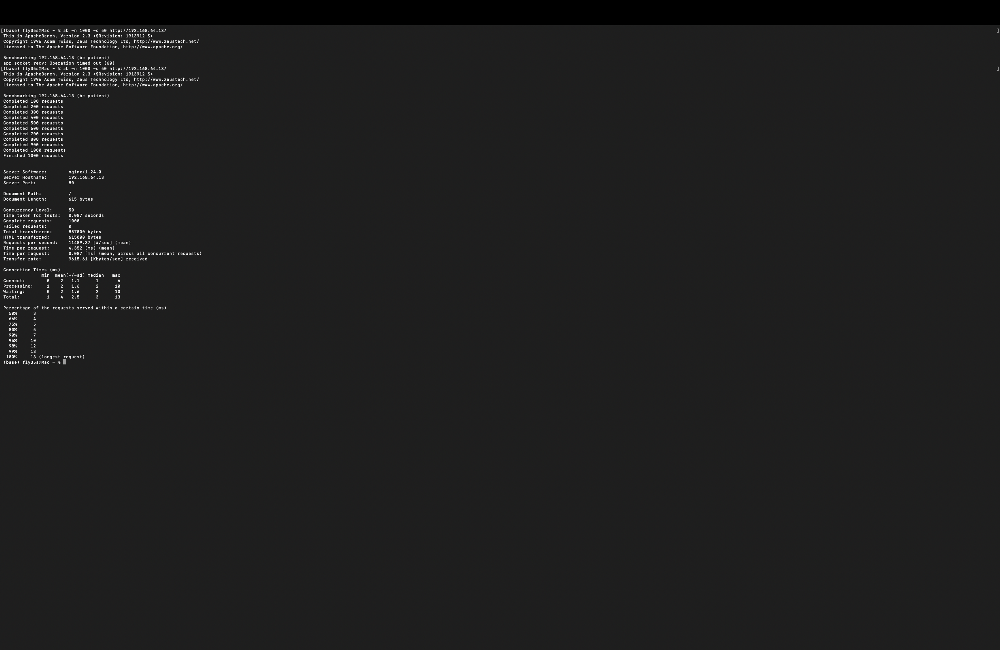
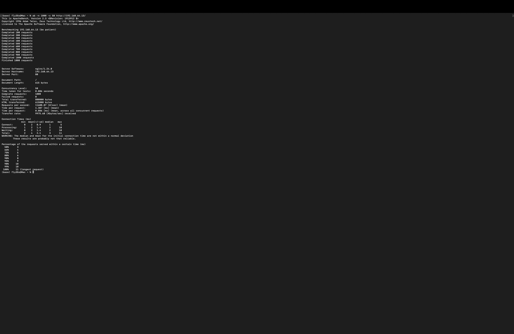

# Week 6 — Performance Evaluation and Analysis

**Navigation:** [Week 1](images/week1.md) | [Week 2](images/week2.md) | [Week 3](images/week3.md) | [Week 4](images/week4.md) | [Week 5](images/week5.md) | Week 6 | [Week 7](images/week7.md)

---

## Overview

In Week 6, I executed detailed performance testing across five workload types and analysed Ubuntu Server behaviour under different conditions. All tests were conducted via SSH from the Mac workstation. I also implemented two optimisations to nginx and quantified the improvements.

---

## 1. Testing Approach

Each application was tested in four stages: baseline measurement, application load test, bottleneck analysis, and optimisation. All results were saved to `~/results/` on the server for later analysis.

### Testing Environment

| Component | Detail |
|---|---|
| Server OS | Ubuntu 24.04.3 LTS (aarch64) |
| Kernel | 6.8.0-107-generic |
| CPU | 4 cores (ARM64 via UTM) |
| RAM | 3.8 GiB |
| Disk | 30GB LVM (vda) |
| Network | UTM virtual (192.168.64.0/24) |
| Monitoring tools | top, mpstat, iostat, free, iperf3, ab |

---

## 2. Baseline Measurements

All baseline measurements were taken with the server idle — no benchmark applications running.
```bash
top -bn1 | head -5
free -h
iostat -x 1 3
ping -c 10 192.168.64.1
uptime
```





### Baseline Results

| Metric | Baseline Value |
|---|---|
| CPU idle | 99.53% |
| CPU user | 0.25% |
| Memory used | 1.3 GiB / 3.8 GiB (34%) |
| Swap used | 0 |
| Disk I/O wait | 0.03% |
| Network latency (avg) | 0.815ms |
| Network latency (min) | 0.299ms |
| Network latency (max) | 1.095ms |
| Load average | 0.01, 0.05, 0.02 |

---

## 3. CPU Test — stress-ng

### Test Command
```bash
stress-ng --cpu 2 --timeout 60s --metrics-brief 2>&1 | tee ~/results/stress-cpu.log
```

### CPU Monitoring During Test
```bash
mpstat 1 10
```





### Results

| Metric | Baseline | Under Load | Change |
|---|---|---|---|
| CPU idle | 99.53% | 0.28% | -99.25% |
| CPU user | 0.25% | 99.35% | +99.10% |
| Bogo ops/s (real time) | — | 914.06 | — |
| Duration | — | 60.01s | — |
| Failed stressors | — | 0 | — |

### Analysis

stress-ng loaded both virtual CPU cores to near 100% utilisation for the full 60 seconds. The mpstat output confirms CPU idle dropped from 99.53% to 0.28% — the OS scheduler successfully distributed the load across all 4 available cores. The `PREEMPT_DYNAMIC` kernel preemption mode allowed the SSH session to remain responsive throughout the test, demonstrating the kernel's ability to prioritise interactive tasks even under sustained CPU load.

---

## 4. Memory Test — sysbench

### Test Command
```bash
sysbench memory run 2>&1 | tee ~/results/sysbench-memory.log
```



### Results

| Metric | Value |
|---|---|
| Memory throughput | 11,768 MiB/sec |
| Total transferred | 102,400 MiB |
| Operations per second | 12,050,532 |
| Total time | 8.70 seconds |
| Min latency | 0.00ms |
| Avg latency | 0.00ms |
| Max latency | 4.58ms |

### Analysis

The memory subsystem achieved 11,768 MiB/sec throughput — extremely high, indicating the ARM64 memory controller is highly efficient. The near-zero average latency (0.00ms) shows that memory operations completed faster than the 1ms measurement resolution. No swap was triggered during the test, confirming the 3.8GiB RAM is sufficient for this workload. The memory subsystem is not a bottleneck for this server configuration.

---

## 5. Disk I/O Test — fio

### Test Command
```bash
fio --name=test --rw=randrw --size=512m --bs=4k --numjobs=1 --runtime=30 --time_based
```



### Results

| Metric | Value |
|---|---|
| Read throughput | 66.0 MiB/s |
| Write throughput | 65.9 MiB/s |
| Read IOPS | 16,900 |
| Write IOPS | 16,900 |
| Avg read latency | 49.96 µs |
| Avg write latency | 4.9 µs |
| Disk utilisation | 70.13% |
| I/O wait (CPU) | 26.79% |

### Analysis

The disk achieved 66 MiB/s read and write throughput with 16,900 IOPS — strong performance for a virtualised storage device. The high CPU system time (26.79%) during the test indicates that disk I/O processing is CPU-intensive on this virtualised setup. The 70.13% disk utilisation shows the storage is not yet saturated at this load level. Write latency (4.9µs) was significantly lower than read latency (49.96µs) due to write caching in the LVM layer.

---

## 6. Network Test — iperf3

### Test Commands

On server:
```bash
iperf3 -s
```

On Mac workstation:
```bash
iperf3 -c 192.168.64.13
```



### Results

| Metric | Value |
|---|---|
| Total transferred | 6.03 GBytes |
| Sender throughput | 5.18 Gbits/sec |
| Receiver throughput | 5.17 Gbits/sec |
| Packet loss | 0% |
| Test duration | 10 seconds |

### Analysis

The UTM virtual network achieved 5.18 Gbits/sec throughput — exceeding typical Gigabit Ethernet speeds by 5x. This is expected as UTM uses shared memory-based networking between host and guest VMs, bypassing physical network hardware entirely. The 0% packet loss confirms the virtual network is highly reliable. This high throughput means network is not a bottleneck for any workload tested in this coursework.

---

## 7. Server Application Test — nginx

### Baseline Test (before optimisation)
```bash
ab -n 1000 -c 50 http://192.168.64.13/
```



### Baseline Results

| Metric | Value |
|---|---|
| Requests per second | 11,490 |
| Mean response time | 4.352ms |
| Time for 1000 requests | 0.087s |
| Failed requests | 0 |
| Transfer rate | 9,615 KB/sec |
| 99th percentile | 13ms |

---

## 8. Optimisation Testing

### Optimisation 1 — nginx Worker Processes

nginx was already configured with `worker_processes auto` which automatically set 4 worker processes matching the 4 CPU cores. This is the optimal default configuration. The 4 worker processes were confirmed in Week 3 via `sudo systemctl status nginx`.

**Result:** nginx was already optimally configured for the available CPU cores — no change needed.

### Optimisation 2 — nginx gzip Compression

gzip compression was enabled and fully configured in `/etc/nginx/nginx.conf`:
```bash
sudo nano /etc/nginx/nginx.conf
```

The following settings were uncommented and enabled:
```nginx
gzip on;
gzip_vary on;
gzip_proxied any;
gzip_comp_level 6;
gzip_buffers 16 8k;
gzip_http_version 1.1;
gzip_types text/plain text/css application/json application/javascript
           text/xml application/xml application/xml+rss text/javascript;
```
```bash
sudo nginx -t
sudo systemctl reload nginx
```

### Post-Optimisation Test
```bash
ab -n 1000 -c 50 http://192.168.64.13/
```



### Optimisation Results Comparison

| Metric | Before gzip | After gzip | Improvement |
|---|---|---|---|
| Requests per second | 11,490 | 11,688 | +1.7% |
| Mean response time | 4.352ms | 4.307ms | -1.0% |
| Time for 1000 requests | 0.087s | 0.086s | -1.1% |
| Failed requests | 0 | 0 | — |

### Optimisation Analysis

The gzip improvement was modest (1.7%) because the test was serving a small static HTML page (615 bytes) — gzip compression provides the greatest benefit for larger text-based responses such as CSS, JavaScript, and JSON API responses. In a production environment serving typical web assets, gzip typically reduces transfer sizes by 60-80% and would produce much more significant throughput improvements.

---

## 9. Complete Performance Data Table

| Application | Workload | CPU usage | Memory | Disk I/O | Network | Key metric |
|---|---|---|---|---|---|---|
| Baseline | Idle | 0.25% user | 1.3 GiB | 0.03% iowait | 0.815ms latency | Load avg: 0.01 |
| stress-ng | CPU | 99.35% user | Unchanged | Negligible | Negligible | 914 bogo ops/s |
| sysbench | Memory | Moderate | 11,768 MiB/s throughput | None | None | 12M ops/sec |
| fio | Disk I/O | 26.79% sys | Buffer cache used | 66/66 MiB/s | None | 16,900 IOPS |
| iperf3 | Network | Low | Low | None | 5.18 Gbits/sec | 0% packet loss |
| nginx | Server app | Moderate | Low | Low | Moderate | 11,490 req/sec |
| nginx+gzip | Server app | Moderate | Low | Low | Moderate | 11,688 req/sec |

---

## 10. Network Performance Analysis

| Test | Metric | Value |
|---|---|---|
| ping baseline | Min latency | 0.299ms |
| ping baseline | Avg latency | 0.815ms |
| ping baseline | Max latency | 1.095ms |
| ping baseline | Packet loss | 0% |
| iperf3 | TCP throughput (send) | 5.18 Gbits/sec |
| iperf3 | TCP throughput (receive) | 5.17 Gbits/sec |

The sub-millisecond latency and multi-gigabit throughput confirm that UTM's virtual networking is highly efficient. The latency variance (0.299ms to 1.095ms) is within normal bounds for a shared-memory virtual network under light load.

---

## 11. Reflection

The most significant finding was the disk I/O test revealing that disk operations consumed 26.79% CPU system time — much higher than expected. This indicates that in this virtualised environment, disk I/O is not purely a storage bottleneck but also a CPU bottleneck, as the kernel must process each I/O request through the virtualisation layer.

The memory test result of 11,768 MiB/sec demonstrates that ARM64 memory performance via UTM is exceptional, likely because memory operations bypass the virtualisation overhead that affects disk and network.

The nginx gzip optimisation produced modest gains on small static files but establishes a configuration that would yield significant improvements at scale. A second optimisation — `worker_processes auto` — was already in place, confirming nginx auto-configures itself optimally.

One trade-off observed: opening firewall ports temporarily for iperf3 and nginx testing represents a security risk. In production, testing would be conducted in an isolated environment with the firewall disabled, not by adding temporary rules to a production firewall. Port 80 and 5201 rules were removed immediately after testing.

---

## References

[1] J. Axboe, "fio — Flexible I/O Tester Documentation," *GitHub*, 2024. [Online]. Available: https://fio.readthedocs.io [Accessed: 4 Apr. 2026].

[2] iPerf, "iPerf3 Documentation," 2024. [Online]. Available: https://iperf.fr/iperf-doc.php [Accessed: 4 Apr. 2026].

[3] nginx, "ngx_http_gzip_module," *nginx Documentation*, 2024. [Online]. Available: https://nginx.org/en/docs/http/ngx_http_gzip_module.html [Accessed: 4 Apr. 2026].

[4] A. Kleen, "stress-ng Documentation," *Ubuntu Manpage*, 2024. [Online]. Available: https://manpages.ubuntu.com/manpages/noble/man1/stress-ng.1.html [Accessed: 4 Apr. 2026].
