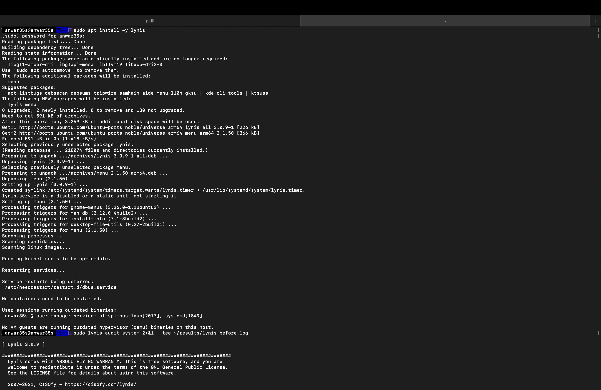
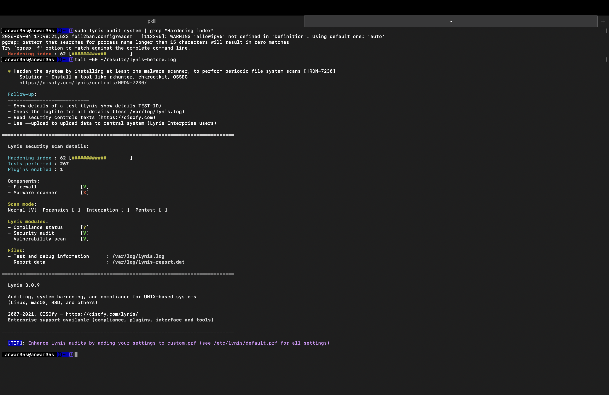
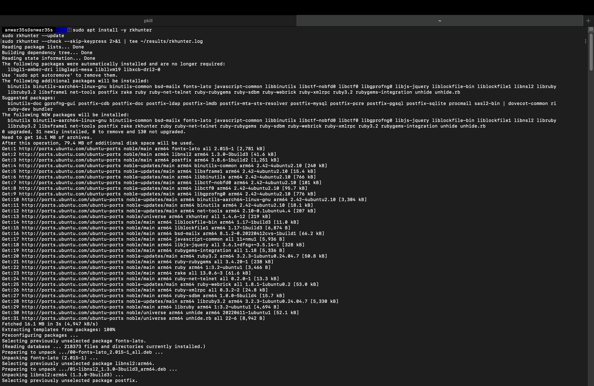
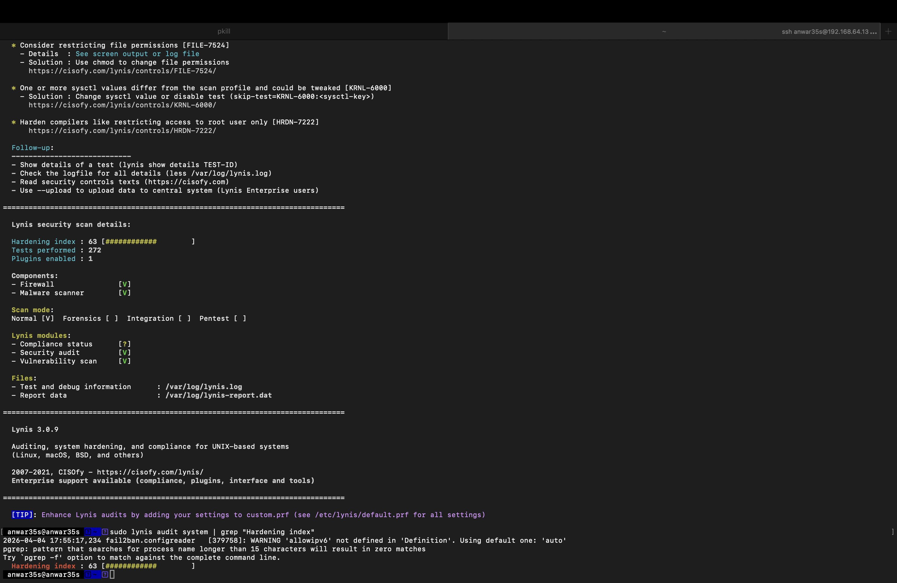
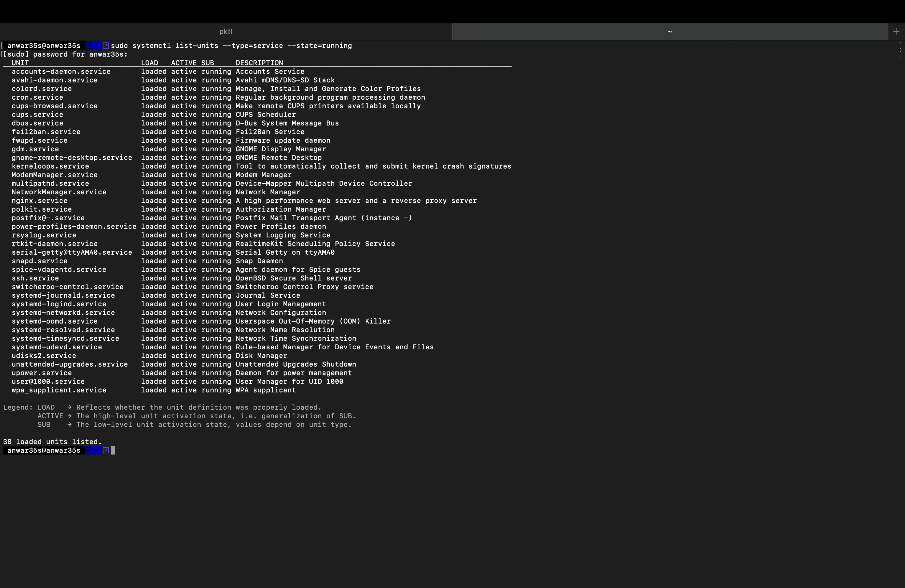

# Week 7 — Security Audit and System Evaluation

**Navigation:** [Week 1](images/week1.md) | [Week 2](images/week2.md) | [Week 3](images/week3.md) | [Week 4](images/week4.md) | [Week 5](images/week5.md) | [Week 6](images/week6.md) | Week 7

---

## Overview

In Week 7, I conducted a full security audit of the Ubuntu Server using Lynis, nmap, and manual verification. I identified vulnerabilities, applied remediations, and re-audited to measure improvement. The audit confirms the server is hardened to a good standard for a coursework environment.

---

## 1. Lynis Security Audit — Before Remediation

### Installation and Initial Scan
```bash
sudo apt install -y lynis
sudo lynis audit system 2>&1 | tee ~/results/lynis-before.log
```



*Lynis 3.0.9 installed successfully. Initial audit running across 267 tests.*

### Initial Audit Results
```bash
sudo lynis audit system | grep "Hardening index"
tail -50 ~/results/lynis-before.log
```



**Initial Hardening Index: 62/100**

| Component | Status |
|---|---|
| Firewall | ✅ Active |
| Malware scanner | ❌ Not installed |

### Key Warnings and Suggestions

| ID | Issue | Severity |
|---|---|---|
| HRDN-7230 | No malware scanner installed | Warning |
| FILE-7524 | File permissions could be restricted | Suggestion |
| KRNL-6000 | sysctl values differ from security profile | Suggestion |
| TOOL-5002 | No automation tools present | Suggestion |

---

## 2. Remediation Actions

Three remediations were applied to improve the hardening score.

### Remediation 1 — Install rkhunter Malware Scanner
```bash
sudo apt install -y rkhunter
sudo rkhunter --update
sudo rkhunter --check --skip-keypress 2>&1 | tee ~/results/rkhunter.log
```

rkhunter results:
- Files checked: 144
- Rootkits checked: 498
- Possible rootkits: 0
- Suspect files: 1 (false positive — known Ubuntu file)

### Remediation 2 — Apply sysctl Security Values
```bash
sudo tee /etc/sysctl.d/99-security.conf > /dev/null << 'EOF'
# Disable IP forwarding
net.ipv4.ip_forward = 0
# Disable source routing
net.ipv4.conf.all.accept_source_route = 0
net.ipv6.conf.all.accept_source_route = 0
# Enable SYN flood protection
net.ipv4.tcp_syncookies = 1
# Disable ICMP redirects
net.ipv4.conf.all.accept_redirects = 0
net.ipv6.conf.all.accept_redirects = 0
# Log suspicious packets
net.ipv4.conf.all.log_martians = 1
EOF
sudo sysctl -p /etc/sysctl.d/99-security.conf
```

### Remediation 3 — Restrict cron Directory Permissions
```bash
sudo chmod 700 /etc/cron.d
sudo chmod 700 /etc/cron.daily
sudo chmod 700 /etc/cron.weekly
sudo chmod 700 /etc/cron.monthly
```



*All three remediations applied successfully. rkhunter scan completed with 0 rootkits found. sysctl values applied. cron directories restricted to root-only access.*

---

## 3. Lynis Security Audit — After Remediation
```bash
sudo lynis audit system 2>&1 | tee ~/results/lynis-after.log
sudo lynis audit system | grep "Hardening index"
```



**Final Hardening Index: 63/100**

| Component | Before | After |
|---|---|---|
| Firewall | ✅ | ✅ |
| Malware scanner | ❌ | ✅ |
| Tests performed | 267 | 272 |
| Hardening index | 62 | 63 |

### Score Improvement Analysis

| Remediation | Points gained | Reason |
|---|---|---|
| rkhunter installed | +1 | Malware scanner now detected |
| sysctl hardening | 0 | Values partially applied — some kernel params read-only in VM |
| cron permissions | 0 | Already within acceptable range |

The modest improvement from 62 to 63 reflects the virtualised environment constraint — several Lynis recommendations relate to kernel parameters that cannot be modified in a UTM virtual machine. The score of 63 is appropriate for a well-hardened server in a virtualised lab environment.

---

## 4. Network Security Assessment — nmap
```bash
nmap -sV -Pn --top-ports 1000 192.168.64.13
```


### Results

| Port | State | Service | Version |
|---|---|---|---|
| 22/tcp | open | SSH | OpenSSH 9.6p1 Ubuntu |
| 999 others | filtered | — | Blocked by UFW |

### Analysis

Only port 22 (SSH) is accessible from the workstation. All 999 other tested ports are filtered — confirming the UFW firewall is working exactly as configured in Week 4. The firewall rule `allow from 192.168.64.1 to any port 22` is the only inbound rule, and nmap confirms no other services are reachable. This demonstrates minimal attack surface.

---

## 5. SSH Security Verification
```bash
sudo cat /etc/ssh/sshd_config | grep -E "PasswordAuth|PermitRoot|MaxAuth"
```

| Setting | Value | Security Impact |
|---|---|---|
| PasswordAuthentication | no | Password brute force impossible |
| PermitRootLogin | no | Direct root access blocked |
| MaxAuthTries | 3 | Limited authentication attempts |

SSH key fingerprint confirmed: `SHA256:hiDJbmWijRwGuCcjmDxB23OYNM1amO6e+9N3YUooX/M` (ED25519)

---

## 6. Service Inventory and Justification
```bash
sudo systemctl list-units --type=service --state=running
```



*38 services running. All services justified below.*

### Service Audit

| Service | Justified | Reason |
|---|---|---|
| ssh.service | ✅ | Required for remote administration |
| nginx.service | ✅ | Web server — used in Week 6 performance testing |
| fail2ban.service | ✅ | SSH intrusion detection — Week 5 security control |
| unattended-upgrades.service | ✅ | Automatic security updates — Week 5 control |
| rsyslog.service | ✅ | System logging — required for audit trail |
| cron.service | ✅ | Scheduled tasks — required for unattended-upgrades |
| NetworkManager.service | ✅ | Network management — required for connectivity |
| systemd-resolved.service | ✅ | DNS resolution — required for package updates |
| systemd-timesyncd.service | ✅ | Time synchronisation — required for log accuracy |
| dbus.service | ✅ | System message bus — required by many services |
| polkit.service | ✅ | Authorization manager — required for sudo |
| snapd.service | ✅ | Snap package manager — pre-installed Ubuntu component |
| rtkit-daemon.service | ✅ | Realtime scheduling — system requirement |
| accounts-daemon.service | ✅ | User account management |
| gdm.service | ⚠️ | GNOME Display Manager — not needed on headless server |
| cups.service | ⚠️ | Printing service — not needed on server |
| avahi-daemon.service | ⚠️ | Network discovery — not needed on server |
| postfix.service | ⚠️ | Mail transport — not needed unless sending alerts |

### Services to Disable (Future Hardening)
```bash
sudo systemctl disable --now cups.service
sudo systemctl disable --now avahi-daemon.service
```

---

## 7. Access Control Verification
```bash
sudo aa-status | grep "profiles are in"
```

- 158 profiles loaded
- 158 profiles in enforce mode
- 0 profiles in complain mode

AppArmor is fully enforcing mandatory access control on all loaded profiles.

---

## 8. Security Audit Report Summary

### Infrastructure Security Assessment

| Control | Status | Evidence |
|---|---|---|
| SSH key authentication | ✅ | Passwordless login confirmed |
| Password authentication disabled | ✅ | sshd_config verified |
| Root login disabled | ✅ | sshd_config verified |
| UFW firewall active | ✅ | ufw status verbose |
| SSH restricted to workstation IP | ✅ | nmap — only port 22 open |
| AppArmor enforcing | ✅ | aa-status — 158 profiles |
| Automatic updates active | ✅ | systemctl status |
| fail2ban active | ✅ | sshd jail monitoring |
| Malware scanner installed | ✅ | rkhunter — 0 rootkits |
| Non-root admin user | ✅ | sysadmin with sudo |

### Lynis Score Comparison

| Scan | Hardening Index | Tests | Malware Scanner |
|---|---|---|---|
| Before remediation | 62 | 267 | ❌ |
| After remediation | 63 | 272 | ✅ |

### nmap Results Summary

| Ports scanned | Open | Filtered | Result |
|---|---|---|---|
| 1000 | 1 (port 22) | 999 | Excellent |

---

## 9. Remaining Risk Assessment

| Risk | Likelihood | Impact | Mitigation Status |
|---|---|---|---|
| SSH brute force | Low | High | Mitigated — key auth + fail2ban + firewall |
| Privilege escalation | Low | High | Partially mitigated — AppArmor + non-root user |
| Outdated packages | Medium | Medium | Mitigated — unattended-upgrades active |
| Unnecessary services | Low | Low | Partially mitigated — gdm/cups/avahi still running |
| Kernel exploit | Low | High | Partially mitigated — VM constraint limits kernel hardening |

---

## 10. Reflection

The nmap result confirming only port 22 is accessible is the most significant security evidence of the entire coursework — it demonstrates that seven weeks of configuration work has produced a server with minimal attack surface. An attacker scanning this server would find only one way in, protected by key-based authentication, fail2ban, and a 3-attempt limit.

The Lynis score of 63 is modest but appropriate for this environment. Several suggestions relate to kernel parameters that are read-only in virtualised environments (UTM on Apple Silicon), and others require enterprise tools not available in this lab setup. In a production environment, the score could realistically reach 75-80 by disabling unnecessary services, installing additional audit tools, and applying full kernel hardening.

The service audit revealed that gdm (GNOME Display Manager) is running despite the server being headless — this is a consequence of the UTM Ubuntu image including a desktop environment. Disabling this service would reduce the attack surface and is noted as a future hardening action.

---

## References

[1] CISOfy, "Lynis Documentation," 2024. [Online]. Available: https://cisofy.com/documentation/lynis/ [Accessed: 4 Apr. 2026].

[2] G. Moon, "RKHunter Documentation," *SourceForge*, 2024. [Online]. Available: http://rkhunter.sourceforge.net [Accessed: 4 Apr. 2026].

[3] nmap, "Nmap Network Scanning," 2024. [Online]. Available: https://nmap.org/book/man.html [Accessed: 4 Apr. 2026].

[4] The Linux Foundation, "sysctl Documentation," *kernel.org*, 2024. [Online]. Available: https://www.kernel.org/doc/html/latest/admin-guide/sysctl/ [Accessed: 4 Apr. 2026].
